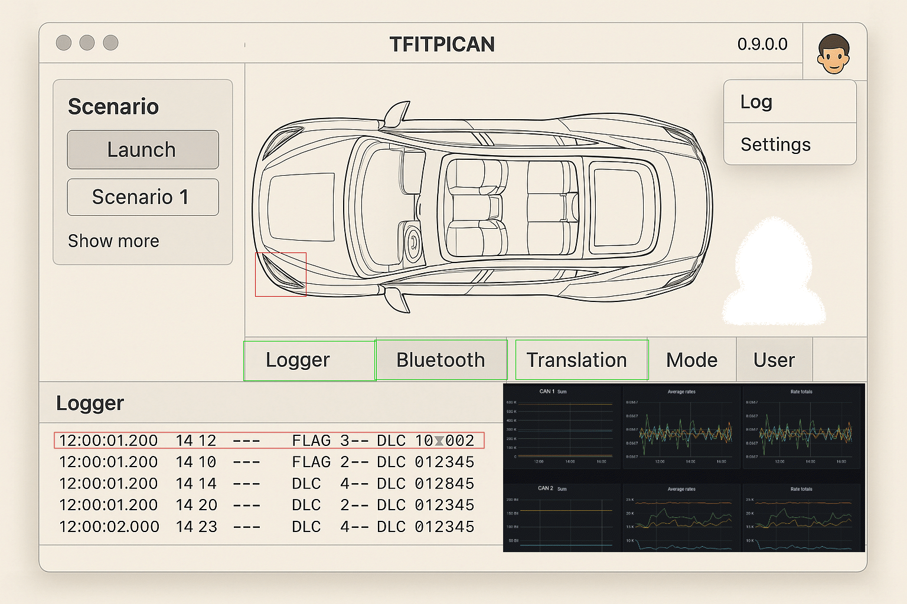

# Architecture Description v015

## Table of Contents

1. [Introduction](#introduction)  
2. [System Overview](#system-overview)  
3. [Architecture Documentation](docs/descriptions/C01-14-tf-canary-architecture-documentation.md)  
4. [Interface Definitions](docs/descriptions/C01-21-tf-canary-interface-definition.md)  
5. [Module Descriptions](#module-descriptions)  
   - 5.1 [PlatformDetector](docs/descriptions/C01-27-tf-canary-plattformDetector.md)  
   - 5.2 [VenvSetup](docs/descriptions/C01-28-tf-canary-venv-setup.md)  
   - 5.3 [PixiEnvironment](docs/descriptions/C01-29-tf-canary-pixi-environment.md)  
   - 5.4 [LoggingSystem](docs/descriptions/C01-30-tf-canary-LoggingSystem.md)  
   - 5.5 [CLI](docs/descriptions/C01-31-tf-canary-cli.md)  
   - 5.6 [ConfigurationManager](docs/descriptions/C01-32-tf-canary-ConfigurationManager.md)  
   - 5.7 [SQLiteDB](docs/descriptions/C01-33-tf-canary-SQLiteDBr.md)  
   - 5.8 [ScenarioLoader](docs/descriptions/C01-34-tf-canary-ScenarioLoader.md)  
   - 5.9 [ScenarioValidator](docs/descriptions/C01-35-tf-canary-ScenarioValidator.md)  
   - 5.10 [ScenarioManager](docs/descriptions/C01-36-tf-canary-ScenarioManager.md)  
   - 5.11 [CarSimulator](docs/descriptions/c01-39_CarSimulator.md)  
   - 5.12 [CANInterfaceFactory](docs/descriptions/c01-40_CANInterfaceFactoryr.md)  
   - 5.13 [VirtualCANInterface](docs/descriptions/c01-41_VirtualCANInterface.md)  
   - 5.14 [HardwareCANInterface](docs/descriptions/c01-42_HardwareCANInterface.md)  
   - 5.15 [CANManager](docs/descriptions/c01-43_CANManager.md)  
   - 5.16 [CANVisualizer](docs/descriptions/C01-44_CANVisualizer.md)  
   - 5.17 [MainWindow](docs/descriptions/c01-45_MainWindow.md)  
6. [Data Model Documentation](docs/descriptions/C01-22-tf-canary-data-model-documentation.md)  
7. [Cross-Cutting Concerns](docs/descriptions/C01-23-tf-canary-Cross-Cutting-Concerns.md)  
8. [Component State Diagrams](docs/diagrams/architecture/c01-26-ScenarioManagerStates.puml)  
9. [Additional Documentation](#additional-documentation)  
   - 9.1 [Makefile](docs/descriptions/C01-24-tf-canary-makefile.md)  
   - 9.2 [Pixi.toml](docs/descriptions/C01-25-tf-canary-pixi.toml)  
10. [Diagrams](#diagrams)  
    - [Dependency Development Chart](docs/diagrams/architecture/c01-13_Dependency_Development_Chart.puml)  
    - [Context Diagram](docs/diagrams/architecture/c01-15%20context%20diagram.puml)  
    - [Component Diagram](docs/diagrams/architecture/c01-16%20component%20diagram.puml)  
    - [Sequence Diagram: Initialization](docs/diagrams/architecture/c01-17%20sequenz%20initialisation.puml)  
    - [Deployment Diagram](docs/diagrams/architecture/c01-18%20deployment%20diagram.puml)  
    - [Architecture Diagram](docs/diagrams/architecture/c01-19_architecture_diagram_puml)  
    - [Sequence Diagram: CAN Message Flow](docs/diagrams/architecture/c01-20_CAN_Message_Flow.puml)  

---

## 1. Introduction
TF-Canary is a Python Developed CAN-Bus Simulator firstly developed vor Raspberry PI and Web. It should give IT-Specialists, Automotive Enthusiasts and Car-Hacker a tool to understand how a car is communicating internally. This Document is intended for Developer or People who want to get a deep understanding. It is not intended as a replacement for the End-User-Documentation.
This architecture documentation provides the  overview of the Canary project, detailing system architecture, module interactions, data models, cross-cutting concerns, and state diagrams. It emphasizes detailed interface definitions, logging, testing, and operational modes.

## 2. System Overview

TF-Canary is a CAN-bus simulation platform supporting GUI and CLI. It integrates different preproduced scenarios and a scenario management, virtual/hardware CAN interfaces, real-time visualization, comprehensive testing, and centralized logging, with three operational modes: Workshop (Kiosk), Default, and User.

[System Overview Diagram](docs/diagrams/architecture/system_overview.puml)

---
### 2.1 Description of the Modes
There are three Modes predefined:

* Default -> The Default Setting, if there is no saved Configuration
* User -> If the User creats his own Setting via the Menu, by default at the next start this will be selected
* Workshop -> Like a Kiosk-Mode. None of the Settings is saved amd on next Start everything is on default. If the User creates a Profile in this Mode, it is NOT selected on the next start. If the User wants to use his profile he explicitly has to take care of selecting his Profile (Changing to "User" -> selecting his Profile). 


## 3. Architecture Documentation
(This Document)
The Architecture Documentation is the framework for the Documentation

- [Architecture Documentation (C01-14-tf-canary-architecture-documentation.md)](docs/descriptions/C01-14-tf-canary-architecture-documentation.md)

## 4. Interface Definitions

- [Interface Definitions (C01-21-tf-canary-interface-definition.md)](docs/descriptions/C01-21-tf-canary-interface-definition.md)

## 5. Module Descriptions

Click on the module name for detailed documentation:

| Module Name            | Documentation |
|------------------------|---------------|
| PlatformDetector       | [C01-27](docs/descriptions/C01-27-tf-canary-plattformDetector.md) |
| VenvSetup              | [C01-28](docs/descriptions/C01-28-tf-canary-venv-setup.md) |
| PixiEnvironment        | [C01-29](docs/descriptions/C01-29-tf-canary-pixi-environment.md) |
| LoggingSystem          | [C01-30](docs/descriptions/C01-30-tf-canary-LoggingSystem.md) |
| CLI                    | [C01-31](docs/descriptions/C01-31-tf-canary-cli.md) |
| ConfigurationManager   | [C01-32](docs/descriptions/C01-32-tf-canary-ConfigurationManager.md) |
| SQLiteDB               | [C01-33](docs/descriptions/C01-33-tf-canary-SQLiteDBr.md) |
| ScenarioLoader         | [C01-34](docs/descriptions/C01-34-tf-canary-ScenarioLoader.md) |
| ScenarioValidator      | [C01-35](docs/descriptions/C01-35-tf-canary-ScenarioValidator.md) |
| ScenarioManager        | [C01-36](docs/descriptions/C01-36-tf-canary-ScenarioManager.md) |
| CarSimulator           | [C01-39](docs/descriptions/c01-39_CarSimulator.md) |
| CANInterfaceFactory    | [C01-40](docs/descriptions/c01-40_CANInterfaceFactoryr.md) |
| VirtualCANInterface    | [C01-41](docs/descriptions/c01-41_VirtualCANInterface.md) |
| HardwareCANInterface   | [C01-42](docs/descriptions/c01-42_HardwareCANInterface.md) |
| CANManager             | [C01-43](docs/descriptions/c01-43_CANManager.md) |
| CANVisualizer          | [C01-44](docs/descriptions/C01-44_CANVisualizer.md) |
| MainWindow             | [C01-45](docs/descriptions/c01-45_MainWindow.md) |

---

## 6. Data Model Documentation

- [Data Model Documentation (C01-22)](docs/descriptions/C01-22-tf-canary-data-model-documentation.md)

## 7. Cross-Cutting Concerns

- [Cross-Cutting Concerns (C01-23)](docs/descriptions/C01-23-tf-canary-Cross-Cutting-Concerns.md)

## 8. Component State Diagrams

- [ScenarioManager State Diagrams (C01-26)](docs/diagrams/architecture/c01-26-ScenarioManagerStates.puml)

## 9. Additional Documentation

- [Makefile (C01-24)](docs/descriptions/C01-24-tf-canary-makefile.md)
- [Pixi.toml (C01-25)](docs/descriptions/C01-25-tf-canary-pixi.toml)

## 10. Diagrams

Click to view diagrams in detail:

- [Dependency Development Chart](docs/diagrams/architecture/c01-13_Dependency_Development_Chart.puml)
- [Context Diagram](docs/diagrams/architecture/c01-15%20context%20diagram.puml)
- [Component Diagram](docs/diagrams/architecture/c01-16%20component%20diagram.puml)
- [Sequence Diagram: Initialization](docs/diagrams/architecture/c01-17%20sequenz%20initialisation.puml)
- [Deployment Diagram](docs/diagrams/architecture/c01-18%20deployment%20diagram.puml)
- [Architecture Diagram](docs/diagrams/architecture/c01-19_architecture_diagram_puml)
- [Sequence Diagram: CAN Message Flow](docs/diagrams/architecture/c01-20_CAN_Message_Flow.puml)

---

## UML Diagrams

### Dependency Development Chart
```plantuml
!include \"uml/c01-13_Dependency_Development_Chart.puml\"
```

### Context Diagram
```plantuml
!include \"uml/c01-15 context diagram.puml\"
```

### Component Diagram
```plantuml
!include \"uml/c01-16 component diagram.puml\"
```

### Sequence Initialization
```plantuml
!include \"uml/c01-17 sequenz initialisation.puml\"
```

### Deployment Diagram
```plantuml
!include \"uml/c01-18 deployment diagram.puml\"
```

### Architecture Diagram
```plantuml
!include \"uml/c01-19_architecture_diagram_puml\"
```

### CAN Message Flow
```plantuml
!include \"uml/c01-20_CAN_Message_Flow.puml\"
```

### Scenario Manager States
```plantuml
!include \"uml/c01-26-ScenarioManagerStates.puml\"
```

### Scenario Class Diagram
```plantuml
!include \"uml/c01-37_scenario_class_diagram.puml\"
```

### Scenario Execution Chart
```plantuml
!include \"uml/c01-37_scenario_execution_chart.puml\"
```

### System Overview
```plantuml
!include \"uml/system_overview.puml\"
```

---

## UI Mockup

Tbe UI Mockup describes the proposed final stage of the GUI.
### Widgets from UI-Mockup
Now follows a short description of the components of the GUI
#### Scenario Selector
The Scenario Selector provides a Single Select Box to select the Scenario the User wants to use. 
#### Car Mockup with Overlay
The Car Mockup shows the Schematics of our simulated car. If a Scenario is Running it would show the involved ECU highlighted
#### User/Profile Icon
The User/Profile Icon hides the Menu and shows what Mode is selected.
### Menu
#### Log
Shows the Realtime Log of the Application -> good for Debugging
#### Settings
The Settings Tab allows
* Save the profile
* Selects the Language
* Allows to save the Application
### Logger Button 
- Enable/Disable
- CAN-Bus Data of the experiment should be saved or dropped
### Bluetooth Button 
- Enable/Disable
- If multiple Canarys are used, they communicate via Bluetooth 
### Translation Button 
- Enable/Disable
- If enabled it would shortcut to the profile and allow to change the screen language
### Mode Display 
- Displays the current Mode
- Shortcuts to the Mode Selection
### Logger Window 
- Shows the Can-Bus Data in a table
- can be configured via the Settings Menu (But not in Workshop Mode)
### Line chart
- Shows a visual representation of the CAN-Bus Data Flow


