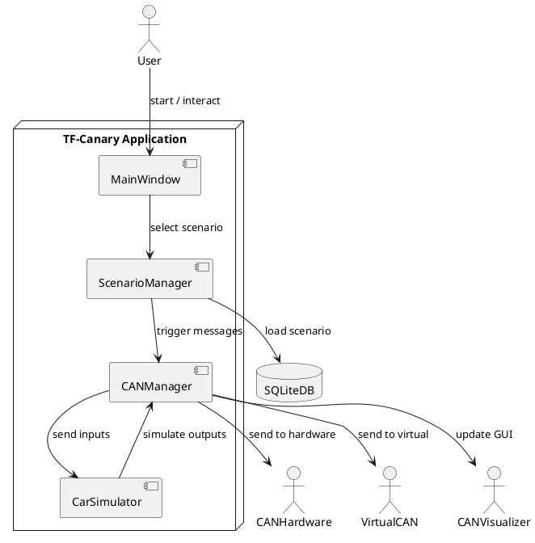
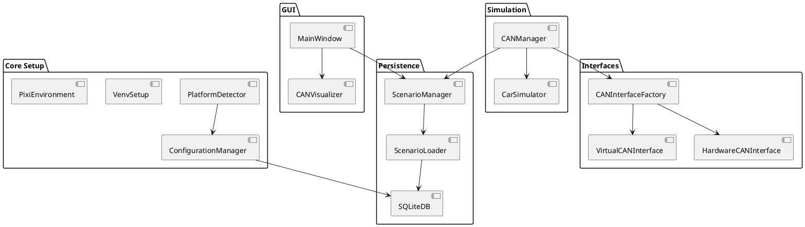
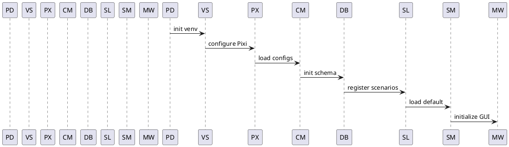
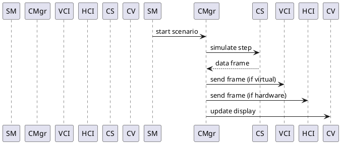
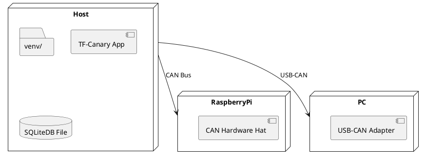

# Architecture Documentation v0.1.1

## Table of Contents

1. [Introduction](#introduction)
2. [System Overview](#system-overview)
3. [Module Descriptions](#module-descriptions)
   - [PlatformDetector](#platformdetector)
   - [VenvSetup](#venvsetup)
   - [PixiEnvironment](#pixienvironment)
   - [ConfigurationManager](#configurationmanager)
   - [SQLiteDB](#sqlitedb)
   - [ScenarioLoader](#scenarioloader)
   - [ScenarioManager](#scenariomanager)
   - [MainWindow](#mainwindow)
   - [Running Program](#running-program)
   - [CANInterfaceFactory](#caninterfacefactory)
   - [VirtualCANInterface](#virtualcaninterface)
   - [HardwareCANInterface](#hardwarecaninterface)
   - [CANManager](#canmanager)
   - [CANVisualizer](#canvisualizer)
   - [CarSimulator](#carsimulator)
4. [Diagrams](#diagrams)
   - [Context Diagram](#context-diagram)
   - [Component Diagram](#component-diagram)
   - [Sequence Diagram: Initialization](#sequence-diagram-initialization)
   - [Sequence Diagram: CAN Message Flow](#sequence-diagram-can-message-flow)
   - [Deployment Diagram](#deployment-diagram)

---

## Introduction

This document provides a comprehensive architecture overview for the TF-Canary project, outlining modules, their responsibilities, and interactions. It includes PlantUML diagrams for visual reference.

## System Overview

TF-Canary is a CAN-bus simulation framework with GUI support for scenario management, virtual/hardware CAN interfaces, and real-time visualization. The system is divided into four phases:

- **Phase 1**: Environment & Core Setup
- **Phase 2**: GUI Implementation
- **Phase 3**: CAN Bus Interfaces
- **Phase 4**: CAN Management & Simulation

## Module Descriptions

### PlatformDetector

Detects the underlying OS and hardware platform at startup, setting configuration flags.

### VenvSetup

Initializes a Python virtual environment for consistent dependency management.

### PixiEnvironment

Configures Pixi for package and dependency management.

### ConfigurationManager

Loads and applies configuration settings from files or environment variables.

### SQLiteDB

Defines schema and provides CRUD operations for persistent storage of scenarios and settings.

### ScenarioLoader

Fetches predefined scenarios from SQLiteDB.

### ScenarioManager

Handles scenario lifecycle, selection, and state management.

### MainWindow

Primary GUI container integrating visualization components and user interactions.

### Running Program

Validates integration of core modules in a minimal working GUI application.

### CANInterfaceFactory

Factory for instantiating virtual or hardware CAN interfaces based on platform.

### VirtualCANInterface

Simulates CAN bus messages for testing without hardware.

### HardwareCANInterface

Interfaces with physical CAN hardware (Raspberry Pi hat or USB-CAN adapter).

### CANManager

Coordinates message flow between scenarios, interfaces, and the car simulator.

### CANVisualizer

Renders real-time CAN data in the GUI.

### CarSimulator

Emulates basic vehicle dynamics responding to CAN messages.

## Diagrams

### C01-15 Context Diagram v0.1.0

### C01-16 Component Diagram v0.1.0

### C01-17 Sequence Diagram: Initialization v0.1.0

### C01-18 Sequence Diagram: CAN Message Flow v0.1.0

### C01-19 Deployment Diagram v0.1.0

