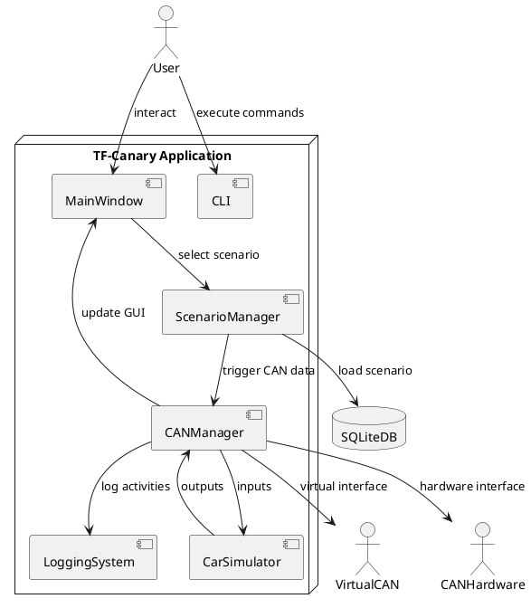
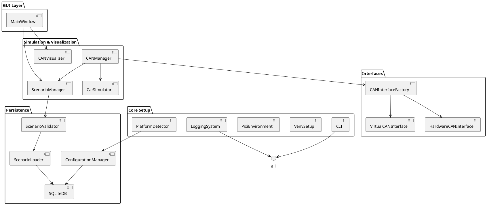
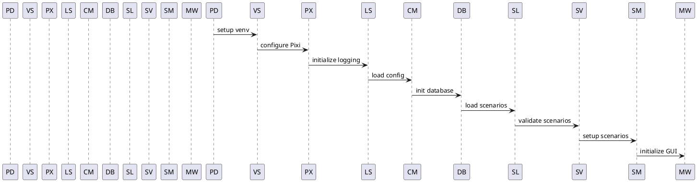
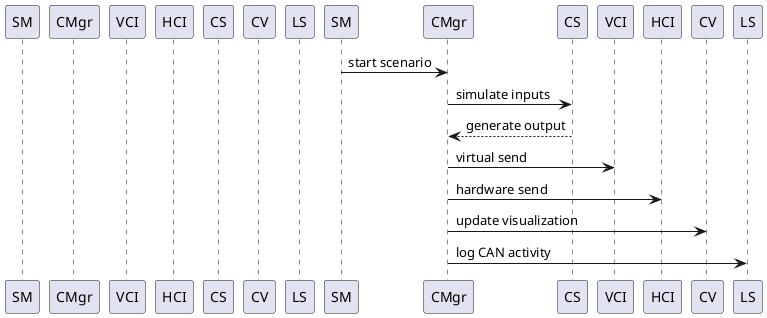
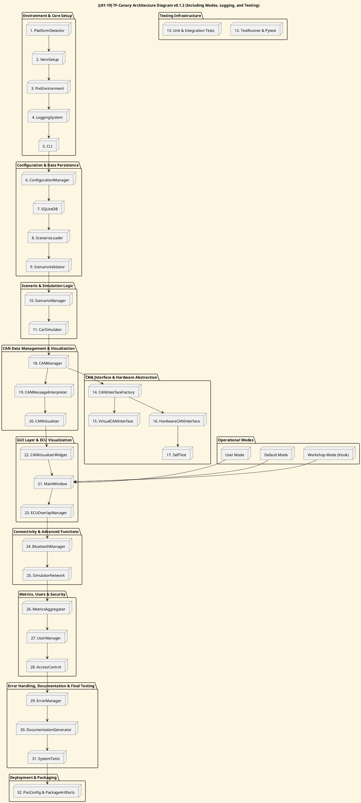

# Architecture Documentation v0.1.2

## Table of Contents

1. [Introduction](#introduction)
2. [System Overview](#system-overview)
3. [Module Descriptions](#module-descriptions)
   - [PlatformDetector](#platformdetector)
   - [VenvSetup](#venvsetup)
   - [PixiEnvironment](#pixienvironment)
   - [LoggingSystem](#loggingsystem)
   - [CLI](#cli)
   - [ConfigurationManager](#configurationmanager)
   - [SQLiteDB](#sqlitedb)
   - [ScenarioLoader](#scenarioloader)
   - [ScenarioValidator](#scenariovalidator)
   - [ScenarioManager](#scenariomanager)
   - [CarSimulator](#carsimulator)
   - [CANInterfaceFactory](#caninterfacefactory)
   - [VirtualCANInterface](#virtualcaninterface)
   - [HardwareCANInterface](#hardwarecaninterface)
   - [CANManager](#canmanager)
   - [CANVisualizer](#canvisualizer)
   - [MainWindow](#mainwindow)
4. [Diagrams](#diagrams)
   - [Context Diagram](#context-diagram)
   - [Component Diagram](#component-diagram)
   - [Sequence Diagram: Initialization](#sequence-diagram-initialization)
   - [Sequence Diagram: CAN Message Flow](#sequence-diagram-can-message-flow)
   - [Architecture Diagram](#architecture-diagram)

---

## Introduction

This updated document provides a refined architecture overview for the TF-Canary project, detailing modules, their responsibilities, and interactions, emphasizing logging, testing, and mode-specific configurations. It includes updated PlantUML diagrams reflecting the current design.

## System Overview

TF-Canary is a CAN-bus simulation platform designed with GUI and CLI support. The system integrates scenario management, virtual/hardware CAN interfaces, real-time visualization, and comprehensive testing and logging capabilities. It supports three operational modes: Workshop (Kiosk), Default, and User.

## Module Descriptions

### PlatformDetector

Detects OS and hardware at startup, setting appropriate configurations.

### VenvSetup

Creates a Python virtual environment to manage consistent dependencies.

### PixiEnvironment

Manages package dependencies, tailored to different hardware platforms.

### LoggingSystem

Provides centralized logging, error tracking, and persistent log handling.

### CLI

Offers command-line interaction for module testing and operation validation.

### ConfigurationManager

Manages application configurations from environment variables and files.

### SQLiteDB

Provides persistent storage with CRUD capabilities for scenarios and configurations.

### ScenarioLoader

Loads predefined scenarios from the SQLite database.

### ScenarioValidator

Validates scenarios for data consistency and correctness.

### ScenarioManager

Controls the lifecycle and management of scenarios.

### CarSimulator

Simulates vehicle dynamics and ECU behaviors in response to CAN messages.

### CANInterfaceFactory

Selects appropriate CAN interfaces based on detected hardware or virtual environment.

### VirtualCANInterface

Simulates CAN-bus interactions for testing purposes.

### HardwareCANInterface

Interfaces with physical CAN-bus hardware, including Raspberry Pi CAN shields and USB adapters.

### CANManager

Coordinates the data flow between scenarios, CAN interfaces, and car simulation.

### CANVisualizer

Visualizes real-time CAN-bus data streams within the GUI.

### MainWindow

Integrates GUI components, real-time data visualization, and user interactions.

## Diagrams

### [c01-15] Context Diagram v0.1.1

### [c01-16] Component Diagram v0.1.1

### [c01-17] Sequence Diagram: Initialization v0.1.1

### [c01-20] Sequence Diagram: CAN Message Flow v0.1.1

### [c01-19] Architecture Diagram v0.1.2

