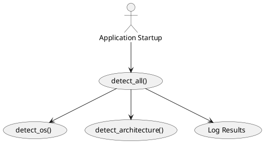
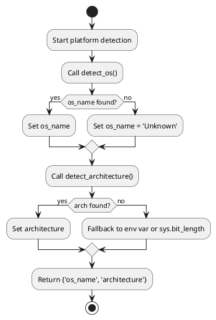
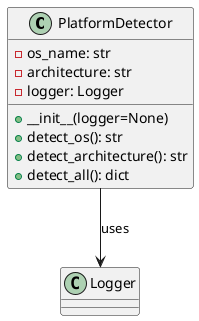

# PlatformDetector Class

## Overview
The `PlatformDetector` class is designed to identify the operating system and hardware architecture at application startup. Accurate detection of the underlying platform is critical for:

- Conditional loading of platform-specific modules and dependencies.
- Setting environment-specific flags and configurations.
- Ensuring compatibility across different hardware setups.

This document covers:
- Class responsibilities and design logic.
- UML diagrams (Use Case, Flowchart, Class Diagram).
- Python coding guidelines and dependencies.
- Logging strategy and initialization sequence.
- Startup integration.
- Unit testing recommendations.

---

## Class Definition and Logic

```python
import platform
import sys
import os
import logging

class PlatformDetector:
    """
    Detects and records the current operating system and hardware architecture.

    Attributes:
        os_name (str): Name of the operating system (e.g., 'Linux', 'Windows', 'Darwin').
        architecture (str): Hardware architecture (e.g., 'x86_64', 'arm64').
        logger (logging.Logger): Logger instance for diagnostic messages.
    """

    def __init__(self, logger: logging.Logger = None):
        # Initialize logger
        self.logger = logger or logging.getLogger(__name__)
        self.os_name = None
        self.architecture = None

    def detect_os(self) -> str:
        """
        Determines the operating system using Python's platform module.

        Returns:
            str: The normalized OS name.
        """
        raw = platform.system()
        self.os_name = raw if raw else 'Unknown'
        self.logger.debug(f"Detected OS: {self.os_name}")
        return self.os_name

    def detect_architecture(self) -> str:
        """
        Identifies the hardware architecture using platform and sys modules.

        Returns:
            str: The CPU architecture identifier.
        """
        arch = platform.machine()
        if not arch:
            arch = os.environ.get('PROCESSOR_ARCHITECTURE', '') or sys.maxsize.bit_length()
        self.architecture = str(arch)
        self.logger.debug(f"Detected architecture: {self.architecture}")
        return self.architecture

    def detect_all(self) -> dict:
        """
        Runs full detection sequence for OS and architecture.

        Returns:
            dict: Keys 'os_name' and 'architecture'.
        """
        self.logger.info("Starting full platform detection...")
        return {
            'os_name': self.detect_os(),
            'architecture': self.detect_architecture(),
        }
```

### Design Notes
1. **Dependency Minimization**: Uses only Python stdlib modules (`platform`, `os`, `sys`, `logging`).
2. **Normalization**: Converts raw platform identifiers to normalized strings.
3. **Extensibility**: Easily extendable to gather additional details (e.g., kernel version).
4. **Fallback Strategy**: Provides sensible defaults if primary detection fails.

---

## UML Diagrams

### Use Case Diagram


### Flowchart of `detect_all()`


### Class Diagram


---

## Logging Strategy

- **Logger Injection**: Accepts an external `logging.Logger` for flexibility.
- **Log Levels**:
  - `DEBUG`: Detailed detection steps and raw values.
  - `INFO`: High-level summaries (e.g., "Full detection complete").
  - `WARNING` / `ERROR`: Unexpected or missing values.

```python
logging.basicConfig(
    format='%(asctime)s %(levelname)s [%(name)s]: %(message)s',
    level=logging.DEBUG
)
logger = logging.getLogger('tf-canary.PlatformDetector')
```

---

## Startup Integration

Invoke early in the bootstrap:
```python
from tf_canary.platform_detector import PlatformDetector

detector = PlatformDetector(logger)
env = detector.detect_all()

if env['os_name'] == 'Linux':
    os.environ['CANARY_USE_EPOLL'] = '1'
elif env['os_name'] == 'Windows':
    os.environ['CANARY_USE_IOCP'] = '1'
``` 

---

## Testing

### Unit Tests (pytest)
```python
import pytest
from tf_canary.platform_detector import PlatformDetector

class DummyLogger:
    def __init__(self): self.records = []
    def debug(self, msg): self.records.append(('DEBUG', msg))
    def info(self, msg): self.records.append(('INFO', msg))

@pytest.fixture
def logger(): return DummyLogger()

@pytest.fixture
def detector(logger): return PlatformDetector(logger)

def test_detect_os(detector, logger):
    name = detector.detect_os()
    assert name in ['Linux','Windows','Darwin','Unknown']
    assert any('Detected OS' in msg for lvl,msg in logger.records)

def test_detect_architecture(detector, logger):
    arch = detector.detect_architecture()
    assert isinstance(arch, str)
    assert any('Detected architecture' in msg for lvl,msg in logger.records)
```

### Integration Tests
```python
from unittest import mock

def test_full_detection(monkeypatch, detector):
    monkeypatch.setattr('platform.system', lambda: 'Linux')
    monkeypatch.setattr('platform.machine', lambda: 'x86_64')
    result = detector.detect_all()
    assert result == {'os_name':'Linux','architecture':'x86_64'}
``` 

---

## Summary
Centralizing platform detection in `PlatformDetector` ensures robust, environment-aware initialization. The UML diagrams illustrate actor interactions, method flow, and class structure, aiding maintainability and onboarding.


