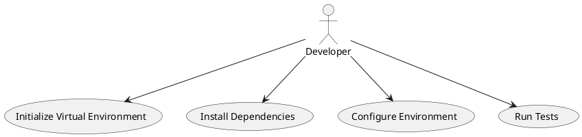
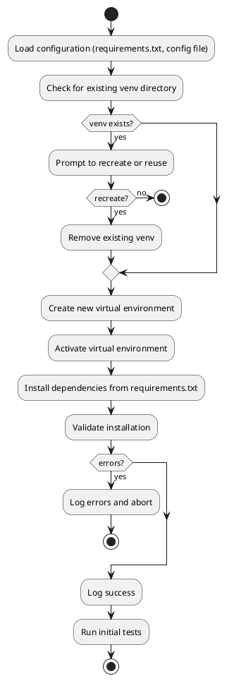
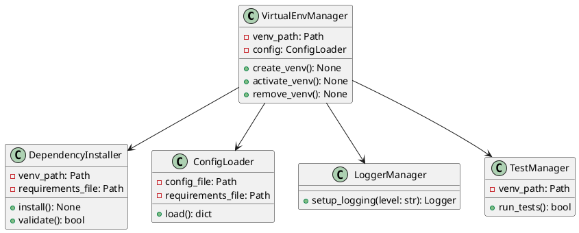

# C01-28-tf-canary-venv-setup.md

This document outlines the design and implementation of the Python virtual environment setup for the Canary CAN-Bus Simulator. It introduces the core classes, UML diagrams (use-case, flowchart, class diagram), and provides details on coding conventions, logging, startup, and testing.

---

## 1. Use-Case Diagram



**Description**: Illustrates how a developer interacts with the system to create, configure, and validate a Python virtual environment.

---

## 2. Flowchart



---

## 3. Class Diagram



---

## 4. Class Descriptions

### 4.1 `ConfigLoader`

- **Responsibility**: Read and parse configuration files, e.g., `requirements.txt` and optional `.env` settings.
- **Key Methods**:
  - `load() -> dict`: Returns a configuration dict containing paths and options.

### 4.2 `VirtualEnvManager`

- **Responsibility**: Manage lifecycle of the virtual environment.
- **Key Methods**:
  - `create_venv()`: Uses `venv` module to create a new environment.
  - `activate_venv()`: Produces activation instruction strings or shell commands.
  - `remove_venv()`: Deletes the virtual environment directory.

### 4.3 `DependencyInstaller`

- **Responsibility**: Install and verify Python package dependencies.
- **Key Methods**:
  - `install()`: Calls pip to install all packages in `requirements.txt`.
  - `validate() -> bool`: Ensures installed packages match requested versions.

### 4.4 `LoggerManager`

- **Responsibility**: Configure Python logging for consistent output.
- **Key Methods**:
  - `setup_logging(level: str) -> Logger`: Initializes handlers, formatters, and returns a logger.

### 4.5 `TestManager`

- **Responsibility**: Run test suite inside the virtual environment.
- **Key Methods**:
  - `run_tests() -> bool`: Invokes `pytest` or `unittest` and returns pass/fail.

---

## 5. Implementation Details

```python
# setup_venv.py
import os
import shutil
import subprocess
from pathlib import Path
from logger_manager import LoggerManager
from config_loader import ConfigLoader
from venv_manager import VirtualEnvManager
from dependency_installer import DependencyInstaller
from test_manager import TestManager


def main():
    logger = LoggerManager().setup_logging(level="INFO")
    config = ConfigLoader(Path("requirements.txt"), Path(".env")).load()

    venv_mgr = VirtualEnvManager(Path(config['venv_path']), config)
    if venv_mgr.venv_path.exists():
        logger.info("Virtual environment exists. Recreating...")
        venv_mgr.remove_venv()

    logger.info("Creating virtual environment...")
    venv_mgr.create_venv()
    activation_cmd = venv_mgr.activate_venv()
    logger.info(f"Activate with: {activation_cmd}")

    dep_installer = DependencyInstaller(venv_mgr.venv_path, Path(config['requirements_file']))
    logger.info("Installing dependencies...")
    dep_installer.install()
    if not dep_installer.validate():
        logger.error("Dependency validation failed.")
        exit(1)

    logger.info("Running tests...")
    tester = TestManager(venv_mgr.venv_path)
    if not tester.run_tests():
        logger.error("Tests failed.")
        exit(1)

    logger.info("Setup complete.")


if __name__ == '__main__':
    main()
```

---

## 6. Logging Configuration

- Uses standard `logging` module.
- Default level: INFO.
- Outputs to console with timestamp, module, level, and message.

```python
# logger_manager.py
import logging

def setup_logging(level: str = "INFO"):
    logger = logging.getLogger("canary_setup")
    logger.setLevel(getattr(logging, level.upper(), logging.INFO))
    ch = logging.StreamHandler()
    formatter = logging.Formatter("%(asctime)s - %(name)s - %(levelname)s - %(message)s")
    ch.setFormatter(formatter)
    logger.addHandler(ch)
    return logger
```

---

## 7. Starting the Setup

1. Ensure Python 3.8+ is installed.
2. Clone the repository and `cd` into the `canary-simulator` root.
3. Place your `requirements.txt` and optional `.env` in the root.
4. Run:
   ```bash
   python setup_venv.py
   ```
5. Follow the activation instruction printed in the logs.

---

## 8. Testing

- Tests are written using `pytest`.
- Place tests under `tests/` directory.
- To run tests manually:
  ```bash
  source venv/bin/activate
  pytest --maxfail=1 --disable-warnings -q
  ```
- Tests include:
  - Creation and removal of venv directory (mocked filesystem).
  - Successful installation of dummy package set.
  - Validation logic for version mismatches.
  - Test suite exit codes.

---

*End of C01-28-tf-canary-venv-setup.md*


