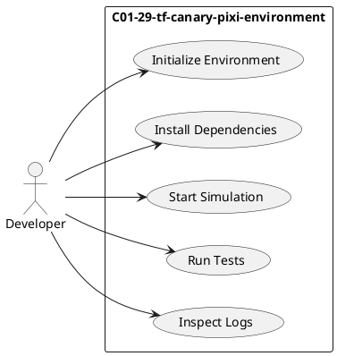
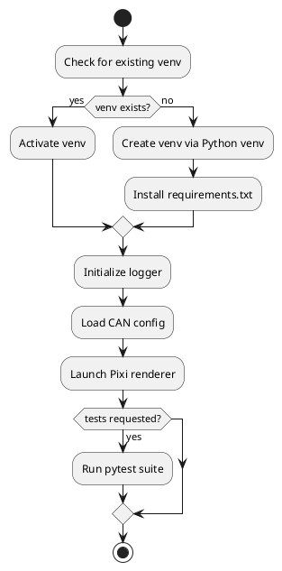
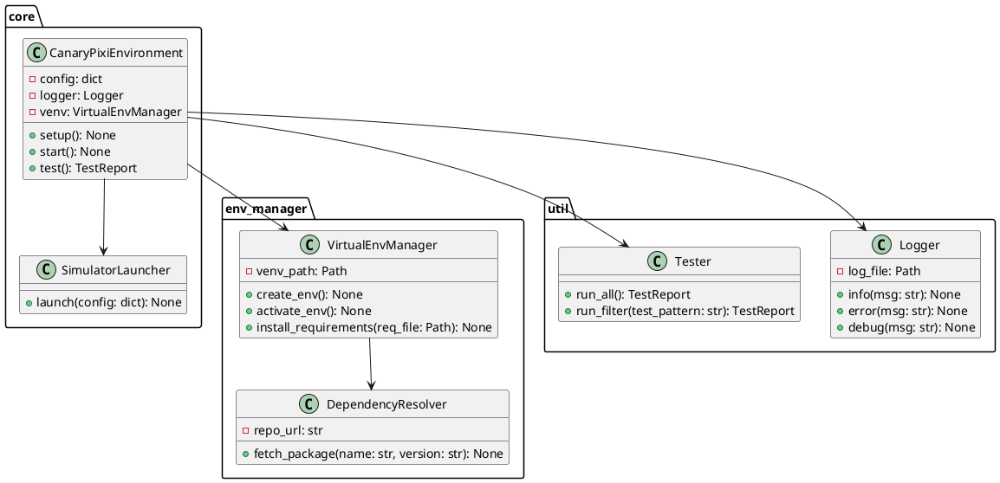

**C01-29-tf-canary-pixi-environment**  
A Python module to manage and run a reproducible Pixi-based CAN-Bus simulator environment. Ensures dependency consistency by creating isolated virtual environments, automating setup, logging operations, and providing hooks for starting and testing the simulation.  

---
## 1. Use‑Case Diagram  

Key actor: **Developer** interacts to set up, run, test, and monitor the Pixi simulation.  

---
## 2. Flowchart of Setup & Execution  


---
## 3. Class Diagram  


---
## 4. Class Descriptions & Logic  
**VirtualEnvManager**  
- **Responsibilities**: Create and activate isolated Python virtual environments; install dependencies.  
- **Key Methods**:  
  - `create_env()`: calls `python -m venv <path>`  
  - `activate_env()`: sources the activation script (cross-platform)  
  - `install_requirements(req_file)`: runs `pip install -r requirements.txt`  

**DependencyResolver**  
- **Responsibilities**: Manage custom or private packages; fetch specific versions if needed.  
- **Key Logic**: Clone or pull from Git repos; verify version constraints.  

**Logger**  
- **Responsibilities**: Structured logging of setup, start, errors, and test results.  
- **Configuration**: Uses Python’s `logging` module with `RotatingFileHandler` for size-based rotation.  

**SimulatorLauncher**  
- **Responsibilities**: Kick off the Pixi.js–based rendering engine for the CAN-Bus simulator.  
- **Integration**: Communicates via subprocess or WebSocket to a Node.js Pixi server.  
- **Pixi Docs**: [Official API Reference](https://pixijs.download/release/docs/index.html)  

**Tester**  
- **Responsibilities**: Discover and run `pytest` tests; aggregate results into `TestReport` objects.  
- **Extensions**: Support for selective tags (`@slow`, `@integration`).  

**CanaryPixiEnvironment**  
- **Orchestrator**: Composes above components to provide a single interface  
- **Methods**:  
  - `setup()`: Ensures venv, resolves deps, initializes logger.  
  - `start()`: Launches simulator, watches logs.  
  - `test()`: Invokes `Tester` and returns pass/fail summary.  

---
## 5. Coding Guidelines  
- Follow [PEP 8](https://peps.python.org/pep-0008/)  
- Use type hints (`mypy` compatible)  
- Organize modules:  
  ```text
  c01_29_tf_canary_pixi/
  ├── __init__.py
  ├── env_manager.py
  ├── dependency_resolver.py
  ├── core.py
  ├── launcher.py
  ├── tester.py
  └── logs/
  ```  

---
## 6. Logging Strategy  
- **Levels**: `DEBUG` for dev traces; `INFO` for high‑level steps; `ERROR` on exceptions.  
- **Format**: `%(asctime)s [%(levelname)s] %(name)s: %(message)s`  
- **Rotation**: max 5 files, 10MB each.  

---
## 7. Starting the Environment  
**CLI Entry Point** `c01_pixi_env` in `setup.py` console_scripts:  
```bash
$ c01_pixi_env setup    # creates venv, installs deps
$ c01_pixi_env start    # launches Pixi simulator
$ c01_pixi_env test     # runs pytest suite
```  

---
## 8. Testing Strategy  
- Use `pytest` with `--cov` for coverage.  
- Structure tests in `tests/` mirroring package layout.  
- Include CI integration (GitHub Actions) to:  
  ```yaml
  - uses: actions/checkout@v2
  - uses: actions/setup-python@v4
    with:
      python-version: '3.10'
  - run: pip install .[test]
  - run: pytest --cov=c01_29_tf_canary_pixi
  ```  

---
*All diagrams rendered with PlantUML. For detailed Pixi.js examples, see [Pixi Cookbook](https://pixijs.io/pixi-cookbook/).*


