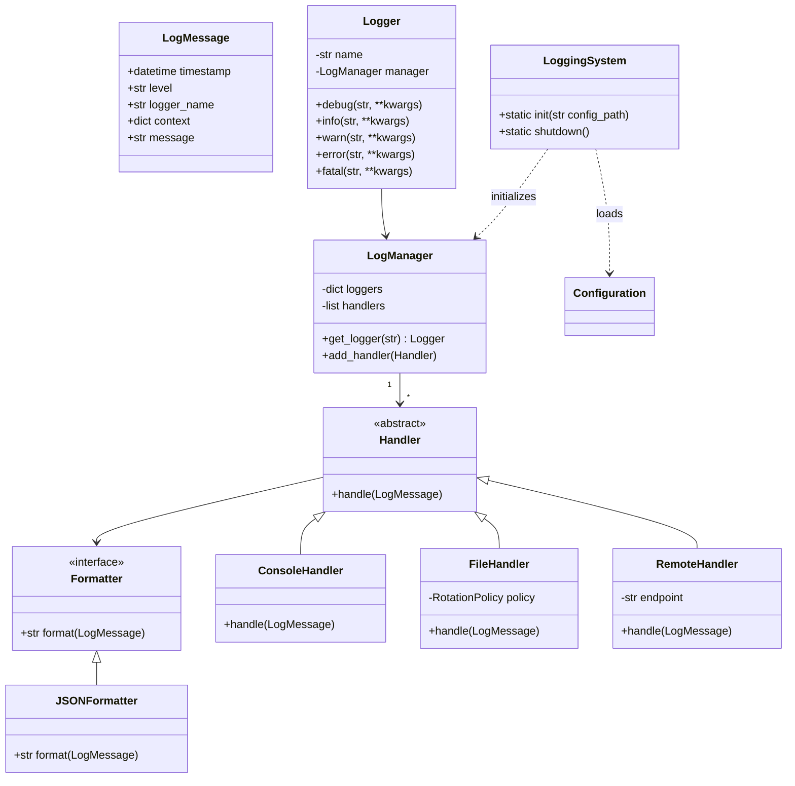

# Canary CAN-Bus Simulator: Centralized Logging System

## Overview
The Centralized Logging System provides a structured, persistent framework for capturing and managing log data across the Canary CAN-Bus Simulator. It enables developers and operators to:

- Emit log messages at various levels (`DEBUG`, `INFO`, `WARN`, `ERROR`, `FATAL`).
- Route messages to multiple outputs (console, files, remote stores).
- Format logs as structured records (JSON) for easy parsing and querying.
- Configure logging behavior at runtime via external configuration.

## Use-Case Diagram
```mermaid
%% Use-Case diagram for Logging System
actor Developer
actor Operator

Developer --> (Initialize Logging)
Developer --> (Emit Log Message)
Operator --> (Configure Logging)
Operator --> (Query Logs)
(Initialize Logging) ..> (Load Configuration)
(Emit Log Message) ..> (Format & Dispatch)
```

## Flowchart: Log Emission
```mermaid
flowchart TD
    A[Application Code] -->|logger.log(level, message)| B[Logger]
    B --> C{Enabled?}
    C -- No --> Z[Drop]
    C -- Yes --> D[LogManager]
    D --> E[handlers[]]
    E --> F[Formatter]
    F --> G{Output Targets}
    G --> H[ConsoleHandler]
    G --> I[FileHandler]
    G --> J[RemoteHandler]
    H --> Z1[Console]
    I --> Z2[Log File]
    J --> Z3[Remote Store]
```

## Class Diagram


## Class Descriptions

### `LogMessage`
Represents a single log event with:
- **timestamp**: `datetime` of the event.  
- **level**: Severity (`DEBUG`, `INFO`, `WARN`, `ERROR`, `FATAL`).  
- **logger_name**: Name of the originating logger (module or class).  
- **context**: Dictionary for structured data (e.g., `transaction_id`, `device_id`).  
- **message**: Human-readable log text.

### `Formatter` / `JSONFormatter`
**Formatter** defines `format(record: LogMessage) -> str`.  
**JSONFormatter** serializes `LogMessage` to JSON for machine parsing, including timestamp, level, name, message, and context.

### `Handler` and Subclasses
Abstract **Handler** receives formatted messages and routes them:
- **ConsoleHandler**: Writes to `stdout` or `stderr`.  
- **FileHandler**: Writes to files; supports size/time rotation.  
- **RemoteHandler**: Sends via HTTP or to a message queue for centralized storage.

### `LogManager`
Singleton managing loggers and handlers:
- **get_logger(name)**: Returns a `Logger` for the given name.  
- **add_handler(handler)**: Registers a `Handler` to receive all `LogMessage`s.

### `Logger`
Facade for application code. Example usage includes structured context:
```python
logger = LogManager.get_logger(__name__)
logger.info("Starting process", context={"transaction_id": tx_id})
```
Internally, each method creates a `LogMessage` and dispatches to `LogManager`.

### `LoggingSystem`
Static entrypoint for setup and teardown:
```python
class LoggingSystem:
    @staticmethod
    def init(config_path: str):
        # load YAML, configure handlers and formatters
        pass

    @staticmethod
    def shutdown():
        # flush and close all handlers
        pass
```

## Logging Logic
1. **Initialization**: `LoggingSystem.init("config/config.yml")` loads levels, handlers, and formatters.  
2. **Emission**: Code calls `logger.debug(...)` or other levels.  
3. **Filtering**: `LogManager` checks if the level is enabled for that logger.  
4. **Dispatch**: Wraps data into `LogMessage`, sends to each `Handler`.  
5. **Formatting**: Handlers use their `Formatter` (e.g., `JSONFormatter`).  
6. **Output**: Handlers deliver to targets (console, file, remote).

## Implementation (Coding)
- **Language**: Python 3.8+
- **Configuration**: `config.yml` example:
```yaml
level: INFO
handlers:
  - type: console
  - type: file
    path: logs/app.log
    rotation: daily
  - type: remote
    endpoint: https://logserver.example.com/ingest
formatter:
  type: json
```
- **Core Components**: Uses Python’s `logging` abstraction or a custom lightweight framework.

#### Example: JSONFormatter & Handlers
```python
import logging, json
from datetime import datetime

class JSONFormatter(logging.Formatter):
    def format(self, record):
        payload = {
            "timestamp": datetime.utcfromtimestamp(record.created).isoformat() + 'Z',
            "level": record.levelname,
            "logger_name": record.name,
            "message": record.getMessage(),
            "context": getattr(record, 'context', {})
        }
        return json.dumps(payload)

class FileHandler(logging.FileHandler):
    def __init__(self, path, rotation_policy):
        super().__init__(path)
        self.rotation_policy = rotation_policy
        # rotation logic here

class RemoteHandler(logging.Handler):
    def __init__(self, endpoint):
        super().__init__()
        self.endpoint = endpoint
    def emit(self, record):
        data = self.format(record)
        # send over HTTP
```

## Starting the Logging System
```python
def main():
    LoggingSystem.init("config/config.yml")
    logger = LogManager.get_logger(__name__)
    logger.info("Application started")
    # ... application logic ...
    LoggingSystem.shutdown()

if __name__ == "__main__":
    main()
```

## Testing
- **Unit Tests**: Patch or stub handlers to capture `LogMessage` and assert fields.  
- **Integration Tests**: Write to temp files, verify rotation, format, and log levels.  
- **CI/CD**: Fail builds on unexpected `ERROR`/`FATAL` logs during automated runs.

## Best Practices for Logging
- **Structured Data**: Pass context dicts instead of embedding data in strings.  
- **Appropriate Levels**: `DEBUG` for deep diagnostics; `INFO` for normal ops; `WARN`/`ERROR` for issues.  
- **PII Safety**: Redact or omit sensitive fields.  
- **Rotation & Retention**: Use file rotation policies to manage disk usage.  
- **Correlation IDs**: Pass transaction or request IDs in context for distributed tracing.

## Leveraging Logging during Development & Testing
- **Enable DEBUG Locally**: Verbose output helps trace issues.  
- **Platform Integration**: Use `journald` on Linux or integrate with Windows Event Log.  
- **Container Environments**: Stream logs to Docker stdout and aggregate with ELK/Splunk.  
- **Automated Alerts**: Hook into CI or monitoring systems to alert on `ERROR`/`FATAL` patterns.

---
*Document: C01-30-tf-canary-LoggingSystem.md*


