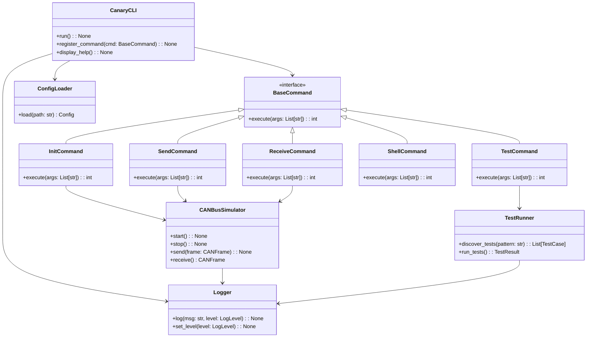

# C01-31-tf-canary-cli Design Document

## Overview
The **C01-31-tf-canary-cli** is the command-line interface for the Canary CAN‑Bus Simulator. It provides advanced users with a modular testing framework, rich logging, and cross‑platform support. Through a unified `CanaryCLI` orchestrator, the user can initialize the simulator, send and receive CAN frames, execute test suites, and inspect logs.

---

## 1. Use Case Diagram
```mermaid
usecaseDiagram
  actor User
  User --> (Initialize Simulator)
  User --> (Send CAN Message)
  User --> (Receive CAN Message)
  User --> (Run Test Suite)
  User --> (View Logs)
  User --> (Interactive Shell)
```

---

## 2. Flowchart
```mermaid
flowchart TD
    A[Start `canary-cli`] --> B{Parse Command}
    B --> |init| C[InitCommand.execute()]
    B --> |send| D[SendCommand.execute()]
    B --> |receive| E[ReceiveCommand.execute()]
    B --> |test| F[TestCommand.execute()]
    B --> |shell| G[Enter REPL]
    B --> |help| H[Display Help]
    C --> I[Configure Logging]
    D --> I
    E --> I
    F --> I
    G --> I
    I --> J[Execute Core Logic]
    J --> K[Output/Exit]
```

---

## 3. Class Diagram


---

## 4. Class Descriptions
- **CanaryCLI**: Entry point. Parses CLI args, registers commands, handles global options (e.g. `--config`, `--verbose`), and invokes `execute` on the selected command.
- **BaseCommand**: Interface defining `execute(args) -> int` for exit codes. All commands implement this.
- **InitCommand**: Loads configuration via `ConfigLoader`, sets up `Logger`, instantiates `CANBusSimulator`, and calls `start()`.
- **SendCommand**: Parses frame definitions (raw hex or JSON script), calls `CANBusSimulator.send()`.
- **ReceiveCommand**: Subscribes to bus, filters by ID or mask, prints frames until timeout or count reached.
- **TestCommand**: Uses `TestRunner` to discover Python test modules matching `--pattern`, runs them, and reports pass/fail.
- **ShellCommand**: Launches an interactive Python REPL with simulator context preloaded for manual testing.
- **CANBusSimulator**: Core simulation engine: `start()`, `stop()`, `send()`, `receive()`.
- **Logger**: Wraps Python's `logging` module. Configured with console and file handlers in `InitCommand`.
- **TestRunner**: Discovers `pytest` style tests, runs via `pytest.main()`, captures results.
- **ConfigLoader**: Parses YAML/JSON into typed `Config` dataclass using `pydantic` or `dataclasses` with validation.

---

## 5. Implementation Guidelines
1. **Language & Framework**: Python ≥3.10. Use [Click](https://click.palletsprojects.com/) for argument parsing to simplify nested commands and flags.
2. **Project Layout**:
   ```bash
   canary-cli/
   ├── src/
   │   └── canary_cli/
   │       ├── __main__.py      # calls CanaryCLI().run()
   │       ├── cli.py           # defines CanaryCLI and bootstrapping
   │       ├── commands/
   │       │   ├── __init__.py
   │       │   ├── init.py
   │       │   ├── send.py
   │       │   ├── receive.py
   │       │   ├── test.py
   │       │   └── shell.py
   │       └── core/
   │           ├── simulator.py
   │           ├── config.py
   │           ├── logger.py
   │           └── testrunner.py
   └── tests/
       ├── test_init.py
       ├── test_send.py
       └── ...
   ```
3. **Logging**: In `cli.py`, configure root logger with `logging.basicConfig()` and add a `FileHandler`. Respect `--verbose` / `--debug` flags to set `DEBUG` level.
4. **Configuration**: Support both YAML and JSON. Example with `pydantic`: define a `Config` model, call `Config.parse_file(path)`.
5. **Entry Point**: In `src/canary_cli/__main__.py`:
   ```python
   from .cli import CanaryCLI

   if __name__ == "__main__":
       exit(CanaryCLI().run())
   ```
6. **Testing**:
   - Use `pytest`.
   - For CLI, use Click’s `CliRunner` to invoke commands in tests.
   - Mock `CANBusSimulator` in unit tests to avoid hardware dependencies.
7. **Cross‑Platform**:
   - Use `pathlib.Path` for filesystem paths.
   - Avoid OS‑specific shell features.
   - Ensure CLI scripts include `#! /usr/bin/env python3` and correct file permissions on Unix.

---

## 6. CLI as Development & Testing Tool
- **Interactive Shell**: `canary-cli shell` drops into REPL with `sim = CANBusSimulator()` loaded. Good for manual frame injection.
- **Verbose/Debug Mode**: `canary-cli --debug init` for stack traces and `DEBUG` logs.
- **Config Overrides**: `--config /path/to/dev-config.yaml` to switch bus speed, test scripts, or log locations.
- **Scriptable**: Integrate in CI/CD pipelines:
  ```bash
  canary-cli test --pattern "tests/test_*.py" --config ci-config.yaml
  ```
- **Platform Testing**: Use `tox` or GitHub Actions to run on Windows, Linux, and macOS. CLI offers consistent entry point across systems.

---

*This design document outlines the architecture, class structure, and best practices to implement, log, start, and test the `C01-31-tf-canary-cli`. The modular approach ensures maintainability, extensibility, and ease of development/testing across platforms.*


