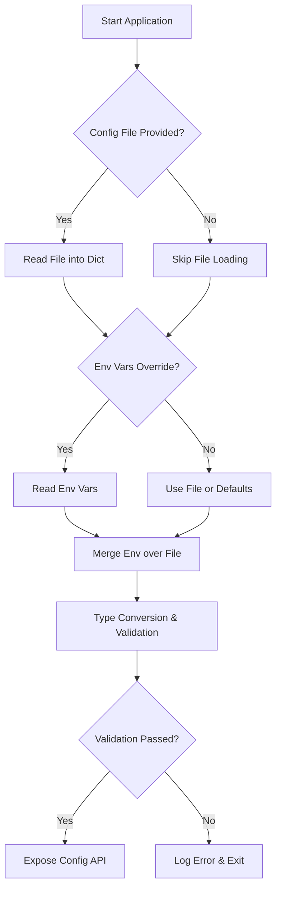
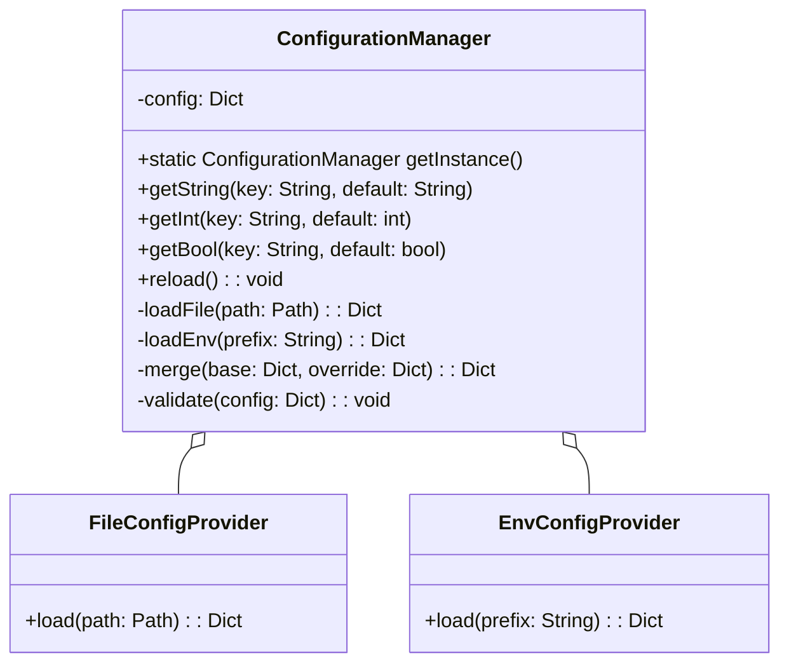

## C01-32-tf-canary-ConfigurationManager

### 1. Overview
The **ConfigurationManager** is responsible for loading and managing application configuration from multiple sources, primarily environment variables and configuration files. It provides a unified API for retrieving configuration values, supports default values, type conversions, and hierarchical overrides. Key responsibilities:

- **Load** configurations at application startup.
- **Merge** settings from environment variables and files, with environment taking precedence.
- **Validate** required parameters and types.
- **Expose** a thread-safe interface for retrieval.
- **Reload** or watch for changes in file-based configurations (optional).

### 2. Use Cases
```mermaid
%%{init: {"theme":"neutral"}}%%
usecaseDiagram
    actor Developer
    actor CI_System as "CI/CD System"
    rectangle CanaryApp {
      Developer -- (Start Application)
      CI_System -- (Run Automated Tests)
      Developer -- (Update .env file)
      (Start Application) .> (Load Configurations)
      (Run Automated Tests) .> (Validate Configurations)
      (Load Configurations) .> (Apply Environment Overrides)
      (Apply Environment Overrides) .> (Provide Config Values)
    }
```  
**Primary Actors**: Developer, CI/CD System  
**Primary Scenarios**:
1. **Start Application**: `ConfigurationManager` loads defaults, files, then env variables.
2. **Update Config**: On config file change (if watch enabled), reload values.
3. **Run Tests**: Ensure missing keys or invalid types are caught before runtime.

### 3. Flowchart of Initialization Logic


### 4. Class Diagram


### 5. Class Description & Logic
- **Singleton Pattern**: `ConfigurationManager` is a thread-safe singleton to ensure consistent state across the application.
- **Providers**: Two helpers (`FileConfigProvider`, `EnvConfigProvider`) abstract source-specific loading logic.
- **Merge Strategy**: Deep-merge maps; environment values override file values.
- **Type Conversion**: Cast raw string inputs to requested types with error handling.
- **Validation**: Check presence of required keys and enforce constraints (e.g., port numbers, non-empty strings).

#### Pseudocode (Python)
```python
import os, json
from threading import Lock

class ConfigurationManager:
    _instance = None
    _lock = Lock()

    def __new__(cls, *args, **kwargs):
        if not cls._instance:
            with cls._lock:
                if not cls._instance:
                    cls._instance = super().__new__(cls)
                    cls._instance._init()
        return cls._instance

    def _init(self):
        self.config = {}
        self._load()

    def _load(self):
        file_cfg = FileConfigProvider.load(os.getenv('CFG_PATH', 'config.json'))
        env_cfg = EnvConfigProvider.load(prefix='CANARY_')
        merged = self._merge(file_cfg, env_cfg)
        self._validate(merged)
        self.config = merged

    def get(self, key, default=None, type_cast=str):
        raw = self.config.get(key, default)
        try:
            return type_cast(raw)
        except (ValueError, TypeError):
            raise ConfigError(f"Invalid type for {key}")

    # ... merge, validate, reload methods ...
```  

### 6. Logging Best Practices
- **Structured Logging**: Use JSON or key-value pairs.
- **Levels**: DEBUG (on load steps), INFO (when config loaded), WARN (missing optional keys), ERROR (validation failures).
- **Context**: Include source (env/file), key name, and values (masked if sensitive).

```python
import logging
logger = logging.getLogger('ConfigManager')
logger.setLevel(logging.INFO)

logger.debug('Loaded file config', extra={'path': cfg_path, 'values': file_cfg})
logger.debug('Loaded env config', extra={'prefix': 'CANARY_', 'values': env_cfg})
```  

### 7. Initialization & Startup
1. **Bootstrap**: Early in `main()`, call `ConfigurationManager.getInstance()`.
2. **Fail-Fast**: On invalid or missing critical configs, log ERROR and exit.
3. **Optional Reload**: For long-running services, support signal-based reload (`SIGHUP`) or watch file.

### 8. Testing Strategies
- **Unit Tests**:
  - Mock environment variables and temp files.
  - Test default fallback, overrides, type casting, and error paths.
  - Use `pytest` fixtures for cleanup.

- **Integration Tests**:
  - Spin up in Docker on Linux/Windows.
  - Mount different config volumes.
  - Validate behavior in CI pipelines.

- **Platform Coverage**: Use matrix builds (GitHub Actions) for Windows, Linux, macOS.

```yaml
# GitHub Actions snippet
tests:
  runs-on: ${{ matrix.os }}
  strategy:
    matrix:
      os: [ubuntu-latest, windows-latest, macos-latest]
  steps:
    - uses: actions/checkout@v2
    - name: Setup Python
      uses: actions/setup-python@v2
      with:
        python-version: '3.x'
    - name: Install dependencies
      run: pip install -r requirements.txt
    - name: Run tests
      run: pytest tests/
```  

---
_This design ensures robust, maintainable configuration management across platforms, leveraging best practices in design patterns, logging, and testing._


