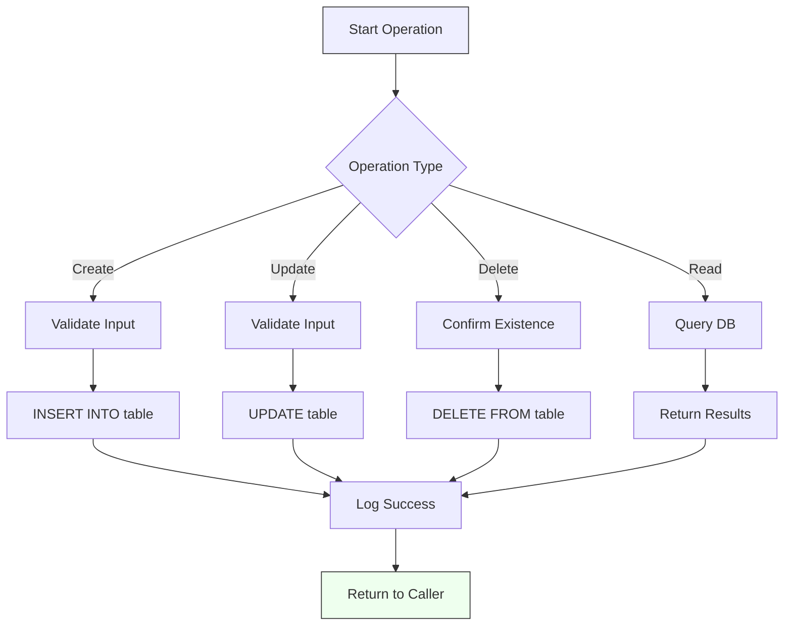
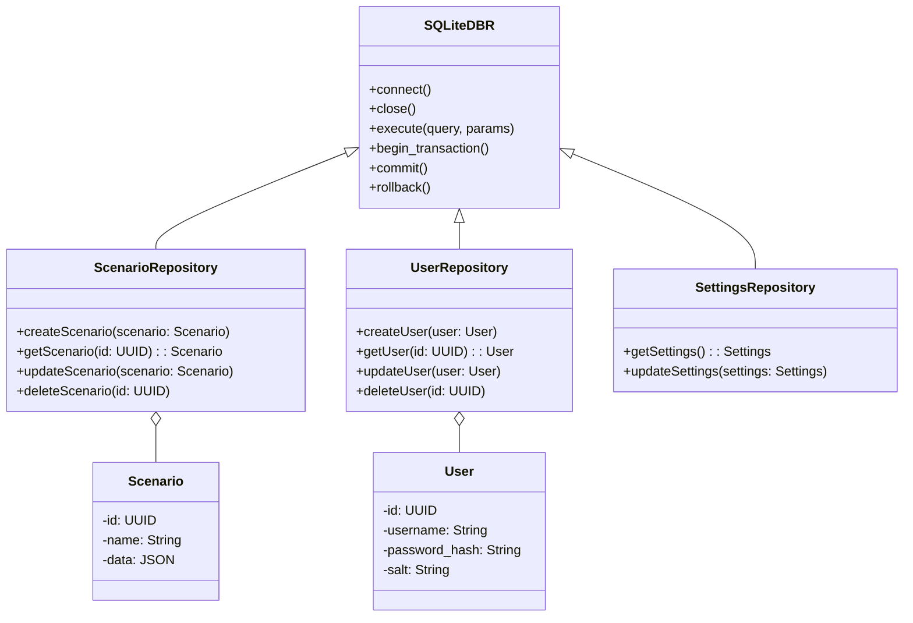

---
# C01-33-tf-canary-SQLiteDBr

A persistent storage solution offering CRUD operations for scenarios and settings, built on SQLite. This document defines the key classes, their logic, logging, startup, testing strategies, and secure handling of Scenario-Data and User-Data, validated on Raspberry Pi platforms.

---

## 1. Use-Case Diagram

```mermaid
%% Use-Case: Scenario & Settings Management
%% Actors: User, Admin, System

actor User
actor Admin
actor System

usecase "Create Scenario" as UC1
usecase "Read Scenario" as UC2
usecase "Update Scenario" as UC3
usecase "Delete Scenario" as UC4
usecase "Configure Settings" as UC5
usecase "Backup Database" as UC6

User --> UC1
User --> UC2
User --> UC3
User --> UC4
Admin --> UC5
System --> UC6
```

---

## 2. Flowchart of CRUD Operation



---

## 3. Class Diagram



---

## 4. Class Descriptions & Logic

### 4.1 SQLiteDBR

Responsible for low-level database interactions.

- **connect()**: Opens a connection to the SQLite file (or in-memory). Supports PRAGMA settings for WAL and foreign keys.
- **execute(query, params)**: Runs parameterized SQL to prevent injection.
- **begin_transaction()**, **commit()**, **rollback()**: Manages atomic operations.

**Logic**: All repositories inherit from SQLiteDBR to obtain a shared `self.conn` and `self.cursor`. Connection is thread-safe (using `check_same_thread=False`) if multi-threaded use is required.

### 4.2 ScenarioRepository

CRUD operations for `Scenario` objects:
- **createScenario**: Validates JSON schema, begins transaction, inserts row, commits.
- **getScenario**: Queries by `id`, parses JSON into `Scenario`.
- **updateScenario**: Checks existence, updates fields.
- **deleteScenario**: Soft delete by flag or hard delete.

### 4.3 UserRepository

Secure user management:
- **createUser**: Generates random salt, hashes password (e.g. PBKDF2), stores salt and hash.
- **getUser**: Fetches by `id` or `username`.
- **updateUser**: Handles password change, re-hashing.
- **deleteUser**: Optionally anonymize data.

### 4.4 SettingsRepository

Single-row settings table for global parameters:
- **getSettings**: Loads config into in-memory object.
- **updateSettings**: Writes back changes.

---

## 5. Implementation Details

- **Language**: Python 3.10+ (also compatible with Python 3.9 on Raspberry Pi OS).
- **Dependencies**:
  - **Core**: `sqlite3`, `pydantic`, `hashlib`, `os`, `logging`
  - **Optional Encryption**: `sqlcipher` (requires system libraries)
- **Raspberry Pi Packages**: On Raspberry Pi OS (Bullseye/Bookworm), install:
  ```bash
  sudo apt-get update && \
  sudo apt-get install -y build-essential libsqlite3-dev libssl-dev python3-dev \
      libffi-dev
  pip3 install pydantic sqlcipher3
  ```
- **Folder structure**:
  ```text
  /db/
    sqlite_dbr.py
    repositories/
      scenario_repo.py
      user_repo.py
      settings_repo.py
  /models/
    scenario.py
    user.py
    settings.py
  /tests/
    test_scenario.py
    test_user.py
    test_settings.py
  ```

---

## 6. Logging Strategy

- Use Python's built-in `logging` module.
- Loggers per module (e.g., `logger = logging.getLogger(__name__)`).
- Log levels:
  - **DEBUG**: SQL statements, parameter values.
  - **INFO**: CRUD operation success.
  - **WARNING**: Recoverable issues.
  - **ERROR**: Exceptions leading to rollback.
- **File rotation**: `RotatingFileHandler`, max 5MB per file, keep 3 backups.

Example:

```python
logger.debug("Executing query: %s with %s", query, params)
```

---

## 7. Startup & Configuration

1. Load environment variables (e.g., `python-dotenv`).
2. Initialize logger before DB.
3. Instantiate DBR:
   ```python
   db = SQLiteDBR(db_path="./data/app.db")
   ```
4. Run migrations (via Alembic or custom scripts).
5. Instantiate repositories with `db` instance.

---

## 8. Testing Strategy

- Unit tests with `pytest`.
- In-memory SQLite (`:memory:`) for fast, isolated tests.
- Fixtures:
  - `db` fixture to create schema.
  - `repo` fixtures for each repository.
- Test cases:
  - Schema validation failures.
  - CRUD happy paths.
  - Transaction rollbacks on exception.
  - Concurrent access.

```python
@pytest.fixture
def db():
    db = SQLiteDBR(db_path=":memory:")
    db.execute_schema("migrations/schema.sql")
    return db
```

---

## 9. Data Security Best Practices

### 9.1 Scenario-Data

- Encryption at rest: SQLCipher or OS-level volume encryption.
- JSON schema validation: `pydantic` to enforce allowed fields.
- Access control: File permissions (600 on Unix).

### 9.2 User-Data

- Password handling: Salt + PBKDF2/HMAC-SHA256, ≥100,000 iterations.
- Mask sensitive fields in logs.
- Database encryption: SQLCipher.
- Data anonymization on deletion.

---

## 10. Cross-Platform Best Practices

- File paths: Use `pathlib` for OS-agnostic paths.
- SQLite library: Bundled SQLite on Windows/macOS/Linux; verify compatibility.
- Line endings: Use LF; configure Git `.gitattributes`.
- CI pipelines: Test on Linux, macOS, and Windows runners.

### 10.1 Raspberry Pi Specifics

- **Operating System**: Raspberry Pi OS (Bullseye/Bookworm). Default Python 3.9, can install 3.10+ via `apt`.
- **Dependencies**: Ensure `libsqlite3-dev`, `libssl-dev`, `build-essential`, `python3-dev`, `libffi-dev` installed.
- **Resource Constraints**: WAL mode recommended to optimize I/O; avoid memory-heavy operations.
- **Filesystem**: Use ext4 on SD card; mount with `noatime` to reduce writes.
- **Service Management**: Provide a `systemd` unit file to start at boot, control memory limits.

---

*End of C01-33-tf-canary-SQLiteDBr.md*


