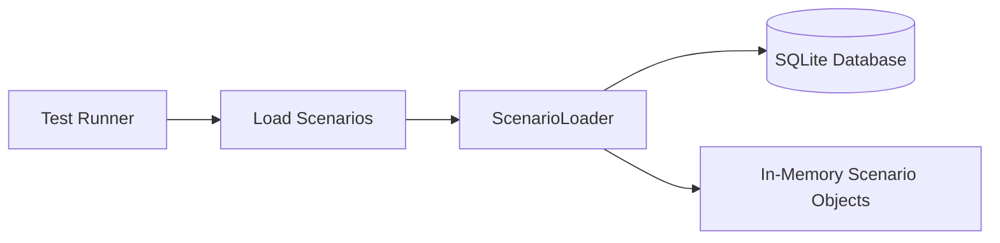
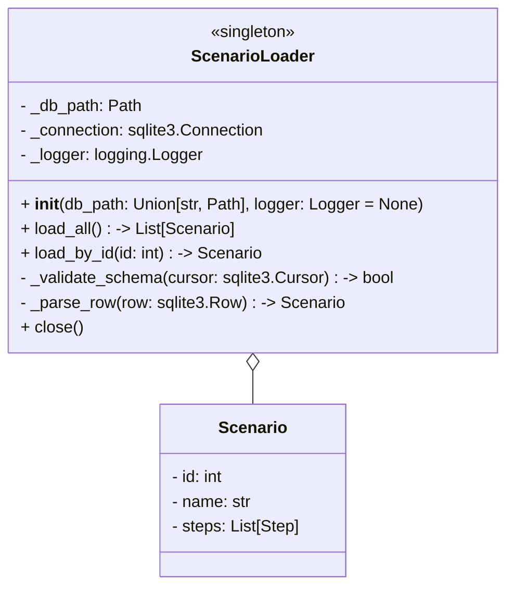

# C01-34-tf-canary-ScenarioLoader

## Overview
The `ScenarioLoader` class is responsible for fetching, parsing, and preparing test scenarios stored in an SQLite database. Designed for the Canary CAN-Bus Simulator, it abstracts database interactions, enforces schema validation, and presents scenarios in a standardized in-memory format ready for execution.

Key features:
- **Database Access**: Uses Python’s `sqlite3` with connection pooling and context managers.
- **Schema Validation**: Ensures scenarios conform to expected structure.
- **Logging**: Integrates with the standard `logging` module for cross-platform consistency.
- **Portable Paths**: Utilizes `pathlib` for OS-independent file handling.

---

## Use Case Diagram

```

---

## Flowchart
```mermaid
graph TD
  start([Start]) --> init[Initialize ScenarioLoader]
  init --> connect[Open DB Connection]
  connect --> query[Execute SELECT * from scenarios]
  query --> validate[Validate Schema]
  validate --> parse[Parse Rows into Objects]
  parse --> ready[Store in Memory]
  ready --> close[Close Connection]
  close --> end([End])
```
```

---

## Class Diagram

```

---

## Class Description

### Responsibilities
- **Initialization**: Set up DB path, logger, and optional configuration.
- **Loading**: Methods to retrieve all scenarios or a single scenario by ID.
- **Validation**: Ensures the `scenarios` table matches the required schema.
- **Parsing**: Converts raw rows into domain `Scenario` objects.
- **Resource Management**: Opens and closes DB connections safely.

### Attributes
| Attribute        | Type                            | Description                                |
|------------------|---------------------------------|--------------------------------------------|
| `_db_path`       | `Path`                          | Filesystem path to the SQLite database.    |
| `_connection`    | `sqlite3.Connection`            | Active database connection.                |
| `_logger`        | `logging.Logger`                | Logger instance for diagnostic messages.   |

### Methods
- `__init__(db_path, logger)`: Initializes loader. Creates default logger if none provided.
- `load_all()`: Returns a list of all scenarios.
- `load_by_id(id)`: Returns a single scenario matching the ID.
- `_validate_schema(cursor)`: Checks table/column existence.
- `_parse_row(row)`: Maps DB row to `Scenario`.
- `close()`: Closes the DB connection.

---

## Implementation Details

### Coding Best Practices
- **Dependency Injection**: Pass in paths and loggers.
- **Context Managers**: Use `with sqlite3.connect(self._db_path) as conn:` to auto-commit and close.
- **Typing**: Leverage Python type hints for clarity and editor support.
- **Path Handling**: Use `pathlib.Path` for cross-OS compatibility.

```python
from pathlib import Path
import sqlite3
import logging
from typing import List, Optional, Union

class ScenarioLoader:
    def __init__(self, db_path: Union[str, Path], logger: Optional[logging.Logger] = None):
        self._db_path = Path(db_path)
        self._logger = logger or logging.getLogger(__name__)
        self._connection = None

    def _connect(self):
        self._logger.debug(f"Connecting to DB at {self._db_path}")
        self._connection = sqlite3.connect(self._db_path)
        self._connection.row_factory = sqlite3.Row

    def load_all(self) -> List[Scenario]:
        self._connect()
        cursor = self._connection.cursor()
        if not self._validate_schema(cursor):
            raise RuntimeError("Invalid schema")
        cursor.execute("SELECT * FROM scenarios;")
        scenarios = [self._parse_row(row) for row in cursor.fetchall()]
        self.close()
        return scenarios
```

### Logging
- Configure a rotating file handler or platform-appropriate sink.
- Use structured messages: include scenario IDs and execution context.

### Startup
- Instantiate once near the test runner entrypoint.
- Example:
```python
if __name__ == "__main__":
    logging.basicConfig(level=logging.INFO)
    loader = ScenarioLoader("./data/scenarios.db")
    all_scenarios = loader.load_all()
    # Pass scenarios to test harness
```

---

## Testing

### Unit Tests (pytest)
- **Isolation**: Use an in-memory SQLite DB (`":memory:"`).
- **Fixtures**: Populate schema and seed data in `setup_module`.
- **Mocking**: Stub file paths and time-dependent logic if needed.

```python
import pytest
from scenario_loader import ScenarioLoader, Scenario

@pytest.fixture
 def loader(tmp_path):
    db = tmp_path / "test.db"
    conn = sqlite3.connect(db)
    # create table and insert seed
    yield ScenarioLoader(db)
    loader.close()

def test_load_all_returns_scenarios(loader):
    scenarios = loader.load_all()
    assert isinstance(scenarios, list)
    assert all(isinstance(s, Scenario) for s in scenarios)
```

### Cross-Platform
- Execute CI pipelines on Linux, macOS, and Windows.
- Verify path handling, permissions, and line endings.

---

*End of C01-34-tf-canary-ScenarioLoader Specification*


