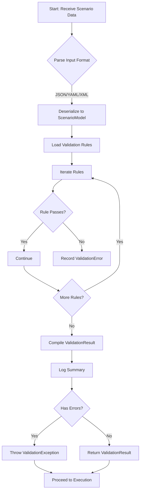
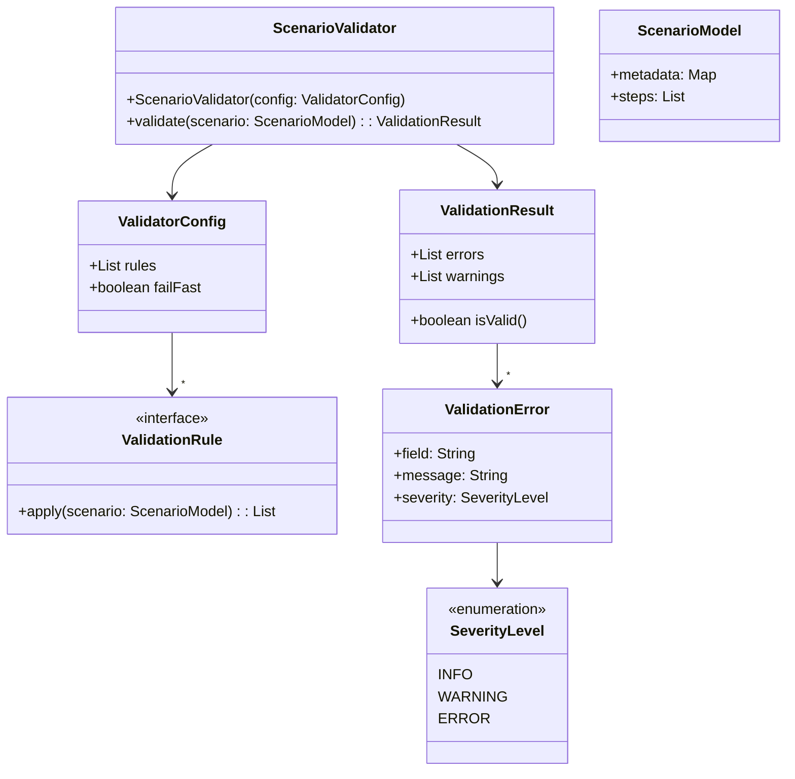

# Scenario Validator `ScenarioValidator`

## Overview
`ScenarioValidator` is a core component of the Canary CAN-Bus Simulator. Its responsibility is to ensure scenario data integrity and correctness before execution. It parses scenario definitions, applies a suite of validation rules, and generates a detailed `ValidationResult`. Errors or warnings are logged according to severity.

Key responsibilities:
- Load raw scenario data (JSON, YAML, XML).
- Apply syntactic and semantic rules.
- Aggregate validation findings into `ValidationResult`.
- Log validation steps and outcomes.
- Expose a clear API for integration in CI pipelines and test harnesses.

## Use-Case Diagram
```mermaid
%% Use-case: Validate scenario before execution
%% Actors: Test Engineer, CI Pipeline, ScenarioExecutor

usecaseDiagram
    actor "Test Engineer" as TE
    actor "CI Pipeline" as CI
    actor "ScenarioExecutor" as EX

    TE --> (Load Scenario)
    TE --> (Validate Scenario)
    CI --> (Trigger Validation)
    EX --> (Validate Scenario)
    (Validate Scenario) .> (Report Results) : includes
    (Report Results) --> TE
    (Report Results) --> CI
    (Report Results) --> EX
```

## Flowchart: Validation Process


## Class Diagram


## Class Descriptions

### `ScenarioValidator`
- **Constructor**: Takes `ValidatorConfig` containing rules and settings.
- **Method** `validate(scenario: ScenarioModel)`: Executes full validation pipeline. Returns a `ValidationResult` or throws `ValidationException` if critical errors are found and `failFast=true`.

### `ValidatorConfig`
Holds the set of `ValidationRule` implementations and flags like `failFast` (abort on first error) or logging verbosity.

### `ValidationRule` (Interface)
Defines `apply(scenario: ScenarioModel) : List<ValidationError>`. Each rule checks one aspect (e.g., unique IDs, timestamp order, parameter ranges).

### `ValidationResult`
Aggregates all `ValidationError` and `ValidationWarning` instances. Offers helper `isValid()`.

### `ValidationError` / `ValidationWarning`
Encapsulate issues found. Include field/context, human-readable message, and severity.

## Validation Logic
1. **Deserialize** input into `ScenarioModel`.
2. **Initialize** `ValidationResult` container.
3. **Load** all `ValidationRule` instances in order defined by `ValidatorConfig`.
4. **Iterate** each rule:
   - Call `rule.apply(scenario)`.
   - Append returned errors to `ValidationResult`.
   - If `failFast` and any error of severity `ERROR`, throw `ValidationException` immediately.
5. **Post-process**: Sort errors by severity and context.
6. **Return** `ValidationResult` or throw.

## Implementation Guidelines
- **Language**: Java or Python recommended. Use SOLID principles and Dependency Injection.
- **Configuration**: Externalize rule definitions via YAML or JSON config.
- **Packaging**: Distribute as a library/module. Provide CLI and API entrypoints.
- **Dependencies**: Use well-known logging (SLF4J/logback for Java, `logging` for Python).
- **Error Handling**: Define `ValidationException` for fatal errors.

## Logging Strategy
- **Logger**: One logger per class (`org.canary.simulator.validator`).
- **Levels**:
  - `DEBUG`: rule-by-rule entry/exits.
  - `INFO`: summary of validation result.
  - `WARN`: non-critical warnings.
  - `ERROR`: critical validation failures.
- **Format**: `[%d{ISO8601}] %-5level %c - %msg%n`

## Initialization & Startup
1. **Load configuration** file (e.g., `validator-config.yaml`).
2. **Instantiate** `ValidatorConfig` and rules via factory or DI container.
3. **Create** `ScenarioValidator`.
4. **Invoke** `validate()` before scenario execution.

```java
// Java example
ValidatorConfig config = ConfigLoader.load("validator-config.yaml");
ScenarioValidator validator = new ScenarioValidator(config);
try {
    ValidationResult result = validator.validate(scenario);
    if (!result.isValid()) {
        logger.error("Scenario validation failed");
        // handle
    }
} catch (ValidationException e) {
    logger.error("Fatal validation error", e);
}
```

## Testing Strategy
- **Unit Tests**: One test per `ValidationRule`, using JUnit/PyTest.
- **Integration Tests**: Full end-to-end validation on sample scenarios.
- **Cross-Platform**: Use GitHub Actions or Jenkins to run on Linux, Windows, macOS.
- **Code Coverage**: Target >90% for validator package.

## Cross-Platform Best Practices
- **File I/O**: Use platform-agnostic path APIs (`Path` in Java, `pathlib` in Python).
- **Line Endings**: Normalize EOLs when reading scenario files.
- **Character Encoding**: Enforce UTF-8.

## Example Scenario
```json
{
  "metadata": { "scenarioId": "SC-001", "author": "QA" },
  "steps": [
    { "id": "step1", "busId": 3, "action": "send", "params": { "data": "0x1A" } },
    { "id": "step2", "busId": 3, "action": "wait", "params": { "durationMs": 100 } }
  ]
}
```

```python
# Python example usage
from canary.sim.validator import ScenarioValidator, ConfigLoader
config = ConfigLoader.load("validator-config.yaml")
validator = ScenarioValidator(config)
result = validator.validate(scenario)
if not result.is_valid():
    for err in result.errors:
        print(f"Error: {err.field} - {err.message}")
```

---
*End of `C01-35-tf-canary-ScenarioValidator.md`*


