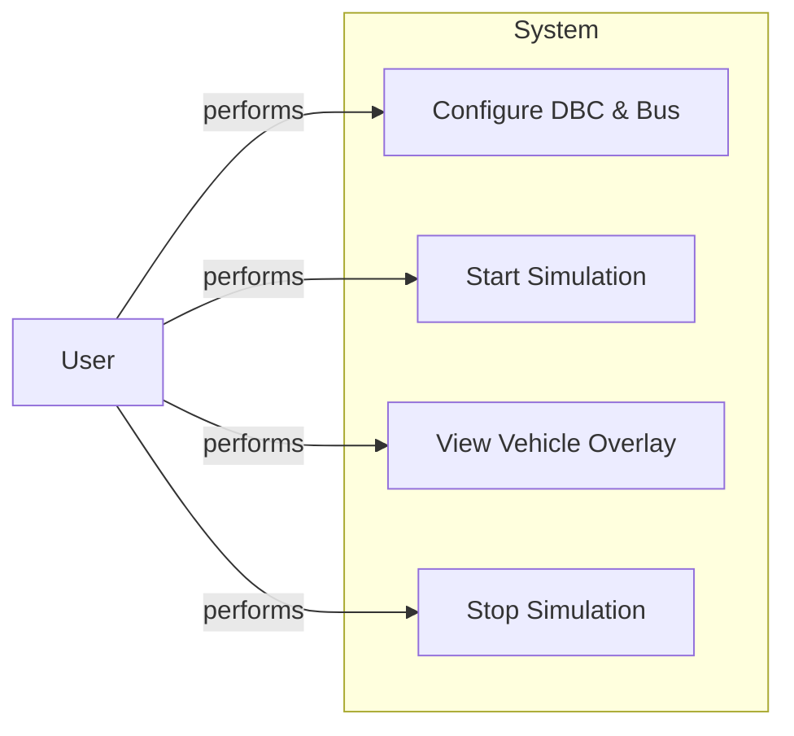
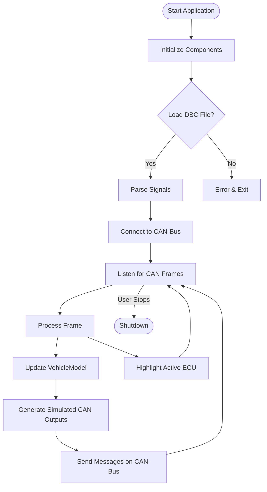
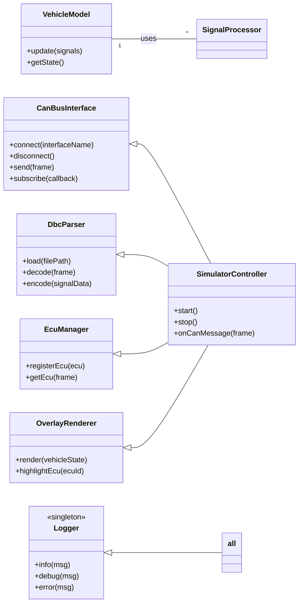

# Car Simulator (Main Application)

**Version**: 1.0.0  
**Module**: c01-39_CarSimulator.md  
**Purpose**: Simulates vehicle dynamics and ECU responses to CAN messages. Provides a visual overlay highlighting involved ECUs. Integrates with CAN-Bus hardware and DBC file definitions.

---

## Table of Contents
1. [Overview](#overview)
2. [Use Case Diagram](#use-case-diagram)
3. [High-Level Flowchart](#high-level-flowchart)
4. [Class Diagram](#class-diagram)
5. [Class Descriptions](#class-descriptions)
   - VehicleModel
   - CanBusInterface
   - DbcParser
   - EcuManager
   - OverlayRenderer
   - SimulatorController
   - Logger
6. [Implementation Details](#implementation-details)
   - Initialization and Startup
   - CAN Message Handling
   - Vehicle Dynamics Update
   - Overlay Highlighting
   - Logging Strategy
7. [Configuration & DBC Integration](#configuration--dbc-integration)
8. [Testing Strategy](#testing-strategy)
9. [Platform & Deployment Considerations](#platform--deployment-considerations)
10. [Appendix: Example DBC File Snippet](#appendix-example-dbc-file-snippet)

---

## Overview
The Car Simulator is the main component of the Canary CAN-Bus Simulator suite. It:

- Listens to live CAN-Bus traffic or replayed log streams.
- Parses CAN frames against a DBC file to interpret signals.
- Updates a mathematical vehicle model (kinematics and simple dynamics).
- Sends simulated feedback messages back onto the bus (e.g., speedometer pulses).
- Renders a graphical overlay of a vehicle schematic, highlighting ECUs as they communicate.

This module orchestrates ECU logic, physical vehicle response, and human-friendly visualization.

---

## Use Case Diagram


---

## High-Level Flowchart


---

## Class Diagram


---

## Class Descriptions

### `SimulatorController`
Coordinates simulation lifecycle:
- Initializes DbcParser, CanBusInterface, VehicleModel, EcuManager, OverlayRenderer, Logger.
- Subscribes to CAN frames and dispatches to handlers.
- Manages startup and graceful shutdown.

### `CanBusInterface`
Abstracts low-level CAN hardware:
- Supports SocketCAN (Linux), PCAN, Kvaser backends.
- Handles connection, disconnection, frame send/receive.
- Publishes incoming frames to subscribed callbacks.

### `DbcParser`
Parses DBC definitions:
- Loads `Message`, `Signal`, and `ECU` entries.
- Decodes raw frames into named signals with scaling, offsets.
- Encodes signal maps into raw bytes for transmission.

### `VehicleModel`
Simulates vehicle state:
- Accepts signals (e.g., throttle, brake, steering).
- Updates kinematic model (speed, heading, position).
- Exposes state for output signal encoding and visualization.

### `EcuManager`
Tracks ECU metadata:
- Maps CAN IDs to ECU logical names and positions on overlay.
- Provides lookup to drive overlay highlighting.

### `OverlayRenderer`
Draws vehicle schematic:
- Renders base image of vehicle top-down view.
- Highlights active ECU nodes in color on message events.
- Runs in its own render loop, configurable FPS.

### `Logger`
Singleton logging facility:
- Configurable sinks: console, file, syslog.
- Supports levels: DEBUG, INFO, WARNING, ERROR.
- Timestamped, thread-safe.

---

## Implementation Details

### Initialization and Startup
1. Read configuration (CAN interface, DBC path, overlay options).
2. `Logger.info()` startup banner.
3. `DbcParser.load(config.dbcFile)` → preload signal maps.
4. `CanBusInterface.connect(config.interface)`.
5. `OverlayRenderer.init(window, resourcePath)`.
6. `SimulatorController.start()` schedules main event loop.

### CAN Message Handling
- Frame callback: `onCanMessage(frame)` in `SimulatorController`.
- Parse with `DbcParser.decode(frame)` → map of signals.
- `VehicleModel.update(signals)` adjusts state.
- `EcuManager.getEcu(frame.id)` → `OverlayRenderer.highlightEcu(ecu.id)`.
- Possibly generate new frames: `DbcParser.encode(outSignals)` and `CanBusInterface.send()`.

### Vehicle Dynamics Update
- Use discrete timestep (e.g., 10ms).
- Simple point-mass model: `v += (throttle - drag) * dt`.
- Yaw update: `heading += steeringAngle * dt`.
- Position integration.

### Overlay Highlighting
- On each CAN event, mark ECU node as "active" for a short timeout (e.g., 200ms).
- Render loop clears highlights after timeout.

### Logging Strategy
- DEBUG: raw frames, parsed signals, model states.
- INFO: simulation start/stop, config load.
- ERROR: DBC parse errors, bus disconnects.
- Rotating file handler to cap disk use.

---

## Configuration & DBC Integration

- `config.yaml` (or JSON) with:
  - `can_interface`: e.g., "can0" or CAN adapter ID
  - `dbc_path`: path to `.dbc` file
  - `overlay_fps`: integer (default: 30)
  - `log_level`: DEBUG/INFO

- Internally, DbcParser maps:
  - Message ID → ECU name + layout position
  - Signals → name, start bit, length, factor, offset

---

## Testing Strategy

1. **Unit Tests** (pytest):
   - DbcParser: load/encode/decode consistency.
   - VehicleModel: deterministic step responses.
   - EcuManager lookup.
2. **Integration Tests**:
   - Replay recorded CAN logs; assert expected outputs.
   - Mock CanBusInterface to inject frames, capture sends.
3. **UI Tests**:
   - Snapshot render of overlay highlights (headless graphics).
4. **Platform Tests**:
   - Linux (SocketCAN), Windows (PCAN), macOS (virtual CAN).

---

## Platform & Deployment Considerations

- **Linux**: native SocketCAN support; recommended for production.
- **Windows/macOS**: requires vendor drivers (PEAK, Kvaser); fallback to log file replay if hardware missing.
- **Cross-compilation**: CMake + Conan for C++ bindings. Python version uses `python-can`.

---

## Appendix: Example DBC File Snippet
```ini
BO_ 100 ENGINE_DATA: 8 ECU1
  SG_ EngineSpeed : 0|16@1+ (0.125,0) [0|8000] "rpm"  ECU1
  SG_ ThrottlePos : 16|8@1+ (0.4,0) [0|100] "%" ECU1

BO_ 200 BRAKE_STATUS: 8 ECU2
  SG_ BrakePedal : 0|8@1+ (0.5,0) [0|100] "%" ECU2
```  
*Frame 100 and 200 definitions for simulation.*

---

*End of c01-39_CarSimulator.md*


