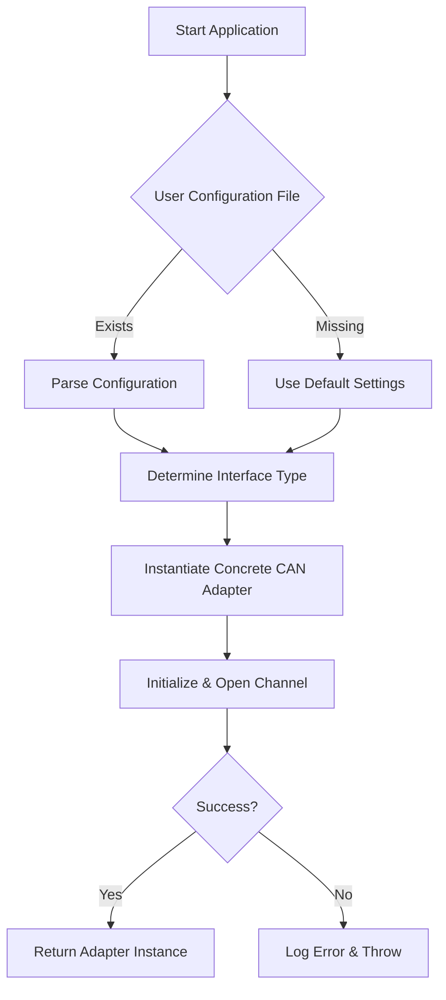

# CANInterfaceFactory

**Purpose:**
The `CANInterfaceFactory` class centralizes the selection and initialization of CAN bus interfaces, whether virtual (e.g., SocketCAN loopback) or hardware-based (e.g., USB-CAN adapters). It encapsulates configuration, logging, platform-specific considerations, and exposes a unified API for upper layers.

---

## Table of Contents
1. [Use Case](#use-case)
2. [High-Level Flow](#high-level-flow)
3. [Class Diagram](#class-diagram)
4. [Class Description & Logic](#class-description--logic)
5. [Coding Guidelines](#coding-guidelines)
6. [Logging](#logging)
7. [Startup & Initialization](#startup--initialization)
8. [Testing Strategies](#testing-strategies)
9. [Platform-Specific Best Practices](#platform-specific-best-practices)

---

## Use Case

```mermaid
mermaid
  %% Use-case diagram for CANInterfaceFactory
  actor User
  actor Application

  rectangle "CAN Configuration System" {
    User -- (Configure CAN Interface)
    Application -- (Request CAN Interface)
    (Configure CAN Interface) ..> (Request CAN Interface)
  }
```  
*User sets parameters (baud rate, channel, mode) and requests an interface instance. The factory returns a ready-to-use `ICANInterface`.*

---

## High-Level Flow


*Flow from application start to CAN interface instantiation and error handling.*

---

## Class Diagram

```mermaid
classDiagram
  interface ICANInterface {
    +open() bool
    +close() bool
    +send(frame: CANFrame) bool
    +receive() CANFrame
  }

  class SocketCANAdapter {
    +open() bool
    +close() bool
    +send(frame: CANFrame) bool
    +receive() CANFrame
  }

  class HardwareCANAdapter {
    +open() bool
    +close() bool
    +send(frame: CANFrame) bool
    +receive() CANFrame
  }

  class CANInterfaceFactory {
    +getInterface(config: CANConfig) : ICANInterface
    -createSocketCAN(config)
    -createHardwareCAN(config)
  }

  CANInterfaceFactory --> ICANInterface
  SocketCANAdapter ..|> ICANInterface
  HardwareCANAdapter ..|> ICANInterface
```  
*`CANInterfaceFactory` returns instances implementing `ICANInterface`.*

---

## Class Description & Logic

### `CANInterfaceFactory`
- **Responsibility:** Choose correct adapter based on `CANConfig` (e.g., a JSON/YAML parsed struct).
- **Public API:**
  - `ICANInterface getInterface(const CANConfig& config);`
- **Internal Methods:**
  - `std::unique_ptr<SocketCANAdapter> createSocketCAN(const CANConfig&);`
  - `std::unique_ptr<HardwareCANAdapter> createHardwareCAN(const CANConfig&);`
- **Logic:**
  1. Validate configuration (channel exists, baud rate supported).
  2. If `config.virtual == true`, use SocketCANAdapter.
  3. Else, detect hardware by `config.adapterType` and instantiate HardwareCANAdapter.
  4. Call `open()`, catch exceptions, and wrap errors in a descriptive exception.

---

## Coding Guidelines

- **Language:** C++17 or later / Python 3.8+ (depending on project stack).
- **Patterns:**
  - Factory Method for adapter selection.
  - RAII for resource management (`open` / `close`).
  - Dependency Injection for ease of testing (inject mock adapters).
- **Error Handling:**
  - Use exceptions with context (`throw CANException("Failed to open CAN channel")`).
- **Thread Safety:**
  - Ensure `send` / `receive` can be called from different threads if required.
  - Use mutexes around adapter state.

---

## Logging

- Use a structured logging library (e.g., **spdlog**, **log4cpp**, **python-loguru**).
- **Log Levels:**
  - `DEBUG` – configuration parameters, adapter type chosen.
  - `INFO` – successful open/close.
  - `WARNING` – recoverable issues (e.g., missing optional fields).
  - `ERROR` – failure to open channel or send frame.
- **Sample Log Messages:**
  ```cpp
  SPDLOG_INFO("Initializing CAN adapter: type={}, channel={}, baud={}Kbps", config.type, config.channel, config.baud);
  SPDLOG_ERROR("Failed to open CAN channel {}: {}", config.channel, err.what());
  ```

---

## Startup & Initialization

1. **Load Configuration** from file or environment.
2. **Instantiate Factory**:
   ```cpp
   CANInterfaceFactory factory;
   auto canIf = factory.getInterface(config);
   ```
3. **Verify Connection**:
   ```cpp
   if (!canIf->open()) {
       // handle error
   }
   ```
4. **Begin Communication**: call `send` / `receive` per application logic.

---

## Testing Strategies

- **Unit Tests:**
  - Mock `ICANInterface` to simulate send/receive success/failure.
  - Verify factory returns correct adapter given different configs.
- **Integration Tests:**
  - **Virtual CAN:** Use SocketCAN loopback on Linux (`sudo modprobe vcan`, `ip link add dev vcan0 type vcan`, `ip link set up vcan0`).
  - **Hardware CAN:** Attach real hardware or use hardware-in-the-loop simulators.
- **CI Setup:**
  - Run against virtual CAN on Linux containers.
  - Skip hardware tests if no adapter is present.

---

## Platform-Specific Best Practices

- **Linux/SocketCAN:**
  - Ensure kernel modules loaded (`vcan`, `can_raw`).
  - Use `libsocketcan` or direct `socket(AF_CAN, SOCK_RAW, CAN_RAW)`.
- **Windows:**
  - Use vendor SDK (e.g., Peak PCAN, Kvaser CANlib).
  - Wrap SDK calls in a unified adapter class.
- **macOS:**
  - Virtual CAN via `slcan` + USB-to-serial adapters.
  - Consider Docker with Linux CAN stack for testing.

---

*End of c01-40_CANInterfaceFactoryr.md*


