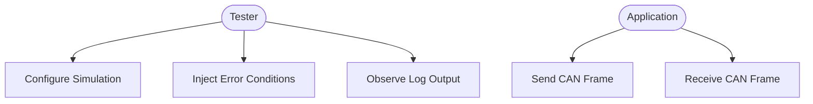
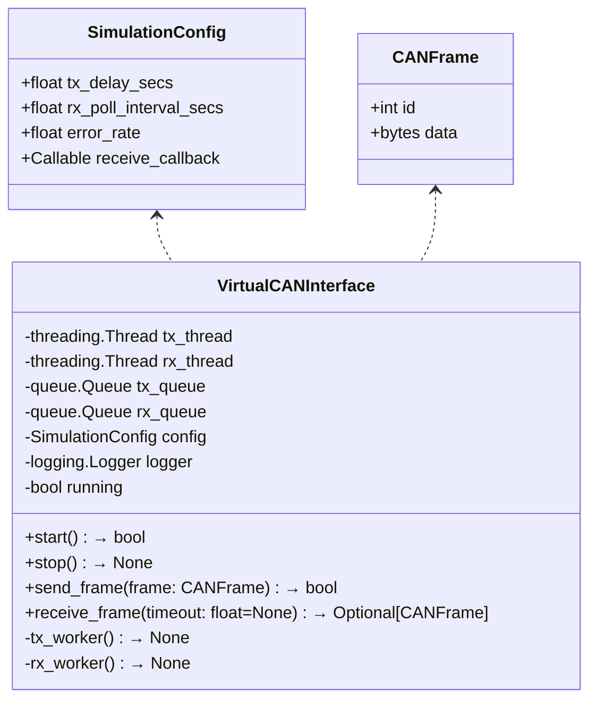

# VirtualCANInterface

## Overview

The **VirtualCANInterface** class provides a pure-Python simulation of a CAN-bus interface for unit and integration testing of CAN applications without hardware. It implements the same API as a real CAN driver so it can be swapped seamlessly into production code.

**Key Features:**
- **Frame Simulation:** Send and receive CAN frames with configurable delays and error injection
- **Thread-Safe Queues:** Uses `queue.Queue` for TX/RX buffering
- **Logging & Diagnostics:** Integrates with Python's `logging` module for structured output
- **Cross-Platform:** Runs on any OS supporting Python's threading and queue modules

---

## Use-Case Diagram



## High-Level Flowchart

```mermaid
flowchart TD
    A[Instantiate VirtualCANInterface] --> B[Configure SimulationConfig]
    B --> C[call start()]
    C --> D{running?}
    D -->|Yes| E[send_frame()/receive_frame()]
    E --> D
    D -->|No| F[call stop()]
    F --> G[Cleanup resources]
    G --> H[Destroy instance]
```

## Class Diagram



## Detailed Description & Logic

### Construction & Configuration
The constructor accepts a SimulationConfig (frame delay, poll interval, error rate, optional receive callback) and a logging.Logger. It initializes internal TX/RX queues and two daemon threads for transmit and receive.

### start() / stop()
- `start()` sets the running flag, launches TX and RX threads, and returns True (or logs and returns False if already running).
- `stop()` clears the running flag, joins threads, flushes both queues, and logs shutdown steps.

### send_frame()
- Validates the frame ID (0–0x7FF) and data length (0–8 bytes).
- Logs at DEBUG level and enqueues into tx_queue.
- Returns True on success, False otherwise.

### receive_frame()
- Attempts to dequeue from rx_queue with optional timeout.
- Logs at DEBUG on success or on timeout.
- Returns a CANFrame or None.

### Error Injection
- In the TX worker, each frame has a config.error_rate chance to be dropped instead of looped back.
- Dropped frames are logged at WARN level.

## Logging Best Practices

### Structured Logging:
```python
logger.info("Sent frame", extra={"id": frame.id, "dlc": len(frame.data)})
```

### Levels:
- DEBUG: state changes, queue operations
- INFO: start/stop events
- WARN: injected errors
- ERROR: invalid frames or callback exceptions

### Thread Safety: 
Use the standard library logger (which is thread-safe) or an async handler if high throughput is needed.

## Initialization & Startup

```python
import logging
from time import sleep

# Configure logging
logging.basicConfig(level=logging.DEBUG)
logger = logging.getLogger("virtual_can")

# Define receive callback
def on_receive(frame):
    print(f"Callback: id=0x{frame.id:X}, data={frame.data.hex()}")

# Set up simulation config
cfg = SimulationConfig(
    tx_delay_secs=0.005,
    rx_poll_interval_secs=0.01,
    error_rate=0.01,
    receive_callback=on_receive
)

# Instantiate and start
vcan = VirtualCANInterface(cfg, logger)
if not vcan.start():
    raise RuntimeError("Failed to start VirtualCANInterface")

# Send a test frame
vcan.send_frame(CANFrame(id=0x123, data=b'\xDE\xAD\xBE\xEF'))
sleep(0.02)

# Stop simulation
vcan.stop()
```

## Testing Strategy

### Unit Tests (pytest or unittest):
- Frame validation rejects bad IDs/DLCs.
- TX/RX queues operate correctly under single and multiple producers/consumers.
- Error injection statistically drops ≈ error_rate * N frames over N sends.

### Integration Tests:
- Loopback Test: send a frame and assert it's received after expected delay.
- Concurrency Test: spawn threads to send/receive concurrently without deadlock.

### Platform Verification:
- Run on Linux, Windows, macOS to ensure threads and timing behave consistently.

### CI Integration:
- Automate tests in GitHub Actions or similar, covering Python 3.7–3.11.

## Implementation (Python)

```python
# Author: Generated by Claude
# Version: 1.0
# Filename: VirtualCANInterface.py
# Pathname: modules/can/
# Description: Provides simulated CAN-bus interactions for testing purposes without hardware requirements

import threading
import queue
import time
import random
import logging
from dataclasses import dataclass
from typing import Callable, Optional

@dataclass
class SimulationConfig:
    """
    Configuration for VirtualCANInterface behavior.
    """
    tx_delay_secs: float
    rx_poll_interval_secs: float
    error_rate: float
    receive_callback: Optional[Callable[['CANFrame'], None]] = None

@dataclass
class CANFrame:
    """
    Simple CAN frame representation.
    """
    id: int
    data: bytes

class VirtualCANInterface:
    """
    Simulates a CAN-bus interface for testing.
    """

    def __init__(self, config: SimulationConfig, logger: logging.Logger):
        self.config = config
        self.logger = logger
        self.tx_queue: queue.Queue[CANFrame] = queue.Queue()
        self.rx_queue: queue.Queue[CANFrame] = queue.Queue()
        self._running = threading.Event()
        self.tx_thread = threading.Thread(
            target=self._tx_worker, name="VCAN-TX", daemon=True
        )
        self.rx_thread = threading.Thread(
            target=self._rx_worker, name="VCAN-RX", daemon=True
        )

    def start(self) -> bool:
        """Start the background TX/RX workers."""
        if self._running.is_set():
            self.logger.warning("VirtualCANInterface already running")
            return False
        self.logger.info("Starting VirtualCANInterface")
        self._running.set()
        self.tx_thread.start()
        self.rx_thread.start()
        return True

    def stop(self) -> None:
        """Stop the workers and clean up."""
        if not self._running.is_set():
            self.logger.warning("VirtualCANInterface not running")
            return
        self.logger.info("Stopping VirtualCANInterface")
        self._running.clear()
        self.tx_thread.join()
        self.rx_thread.join()
        # Flush queues
        with self.tx_queue.mutex:
            self.tx_queue.queue.clear()
        with self.rx_queue.mutex:
            self.rx_queue.queue.clear()
        self.logger.info("VirtualCANInterface stopped")

    def send_frame(self, frame: CANFrame) -> bool:
        """
        Enqueue a frame for transmission.
        Returns True on success.
        """
        if not self._running.is_set():
            self.logger.error("Cannot send: interface not running")
            return False
        if not (0 <= frame.id <= 0x7FF) or not (0 <= len(frame.data) <= 8):
            self.logger.error(f"Invalid frame: id={frame.id}, len={len(frame.data)}")
            return False
        self.logger.debug(f"Enqueuing frame id={frame.id} len={len(frame.data)}")
        self.tx_queue.put(frame)
        return True

    def receive_frame(self, timeout: float = None) -> Optional[CANFrame]:
        """
        Retrieve a frame from the RX queue.
        Returns the frame or None on timeout.
        """
        try:
            frame = self.rx_queue.get(timeout=timeout)
            self.logger.debug(f"Received frame id={frame.id} len={len(frame.data)}")
            return frame
        except queue.Empty:
            self.logger.debug("Receive timeout")
            return None

    def _tx_worker(self) -> None:
        """Internal TX worker: simulates loopback with delay and errors."""
        self.logger.debug("TX worker started")
        while self._running.is_set():
            try:
                frame = self.tx_queue.get(timeout=0.1)
            except queue.Empty:
                continue
            time.sleep(self.config.tx_delay_secs)
            if random.random() < self.config.error_rate:
                self.logger.warning(f"Dropping frame id={frame.id} (error injection)")
                continue
            self.rx_queue.put(frame)
            self.logger.debug(f"Looped back frame id={frame.id}")
        self.logger.debug("TX worker exiting")

    def _rx_worker(self) -> None:
        """Internal RX worker: polls RX queue and invokes callback."""
        self.logger.debug("RX worker started")
        while self._running.is_set():
            time.sleep(self.config.rx_poll_interval_secs)
            if self.config.receive_callback:
                while True:
                    try:
                        frame = self.rx_queue.get_nowait()
                    except queue.Empty:
                        break
                    try:
                        self.config.receive_callback(frame)
                        self.logger.debug(f"Callback invoked for frame id={frame.id}")
                    except Exception as e:
                        self.logger.error(f"Error in receive_callback: {e}")
        self.logger.debug("RX worker exiting")


# Usage Example
if __name__ == "__main__":
    import logging
    from time import sleep

    logging.basicConfig(level=logging.DEBUG)
    logger = logging.getLogger("virtual_can")

    def on_receive(frame: CANFrame):
        print(f"Received: id=0x{frame.id:X}, data={frame.data.hex()}")

    cfg = SimulationConfig(
        tx_delay_secs=0.005,
        rx_poll_interval_secs=0.01,
        error_rate=0.01,
        receive_callback=on_receive
    )
    vcan = VirtualCANInterface(cfg, logger)
    vcan.start()
    vcan.send_frame(CANFrame(id=0x123, data=b'\xDE\xAD\xBE\xEF'))
    sleep(0.02)
    vcan.stop()
```

## References & Further Reading

- ISO 11898-1: CAN protocol specification
- "Testing Embedded Software" by Bart Broeker – chapter on bus simulation
- Python logging documentation: https://docs.python.org/3/library/logging.html
