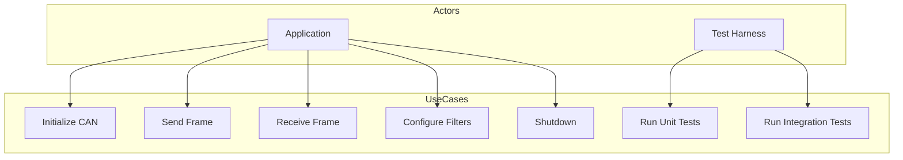
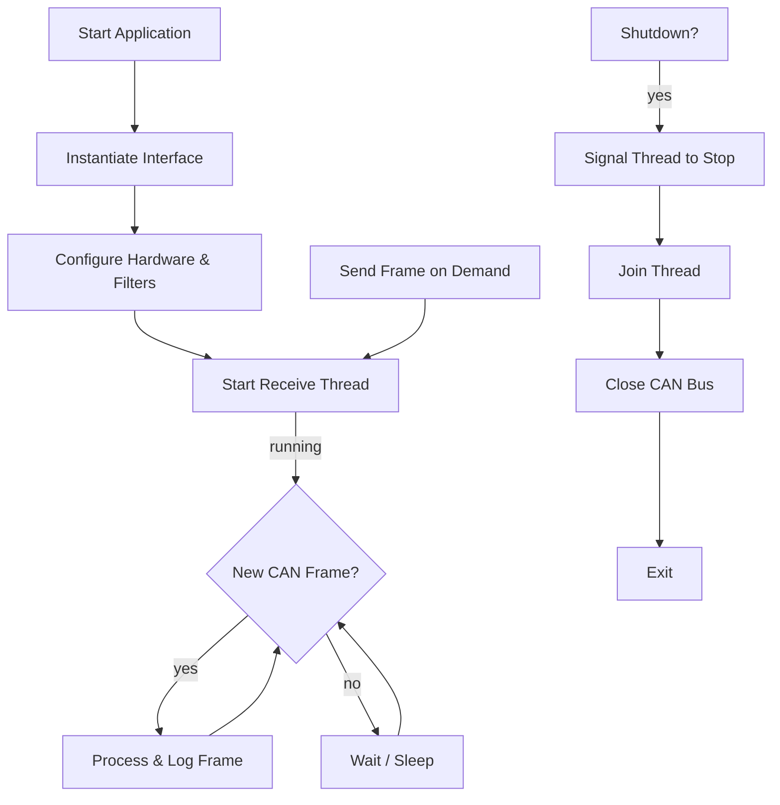

# c01-42_HardwareCANInterface

## Overview

The `HardwareCANInterface` suite provides a unified, extensible way to interface with physical CAN-bus hardware devices for a Raspberry Pi CAN-Bus Simulator. It defines an abstract base class and concrete implementations specifically optimized for Raspberry Pi and macOS environments, allowing for consistent CAN bus operations across these platforms.

Key goals:
- Abstract common CAN operations (send, receive, configure, filter)
- Provide specialized support for Raspberry Pi hardware interfaces
- Offer compatibility solutions for macOS development environments
- Support multiple hardware backends via subclassing
- Thread-safe receive loop with clean startup/shutdown
- Structured, timestamped logging
- Automated unit and integration tests (including virtual CAN)

Supported/adaptable hardware:
- **Raspberry Pi with MCP2515 CAN controller** (via SPI)
- **CANable USB adapters** (e.g. [B087RJ6XGG](https://www.amazon.de/dp/B087RJ6XGG?ref_=ppx_hzsearch_conn_dt_b_fed_asin_title_1))
- **USB-to-CAN adapters for macOS** (e.g. [B0BMQ8GCQC](https://www.amazon.de/dp/B0BMQ8GCQC?ref_=ppx_hzsearch_conn_dt_b_fed_asin_title_7))
- **Raspberry Pi internal CAN interfaces** (when available)

---

## Use-Case Diagram



## Flowchart: Startup & Receive Loop



## Class Diagram

```mermaid
classDiagram
    %% Abstract base
    class HardwareCANInterface {
        <<abstract>>
        +__init__(channel: str, bitrate: int, filters: List[Dict])
        +start(): None
        +stop(): None
        +send_message(msg: can.Message): bool
        +set_filters(filters: List[Dict]): bool
        #_receive_loop(): None
        #configure(): None
        #logger: logging.Logger
        #bus: can.BusABC
        #recv_thread: threading.Thread
        #stop_event: threading.Event
    }

    %% Concrete implementations
    class SocketCANInterface {
        +__init__(channel: str, bitrate: int, filters: List[Dict], callback: Optional[Callable]): None
    }
    class RaspberryPiCanInterface {
        +__init__(channel: str, bitrate: int, filters: List[Dict], callback: Optional[Callable], auto_setup: bool): None
        +setup_can_interface(): bool
        +detect_hardware(): Dict
    }
    class MacOSCanInterface {
        +__init__(channel: str, bitrate: int, filters: List[Dict], callback: Optional[Callable]): None
        +detect_usb_devices(): List[str]
    }
    class CANableInterface {
        +__init__(channel: str, bitrate: int, filters: List[Dict], callback: Optional[Callable]): None
        +setup_slcan_bridge(): bool
    }
    class VirtualCanSimulator {
        +__init__(virtual_bus_name: str, callback: Optional[Callable]): None
        +create_virtual_bus(): bool
        +simulate_traffic(traffic_pattern: Dict): None
        +record_can_traffic(duration: int): List[can.Message]
    }

    HardwareCANInterface <|-- SocketCANInterface
    HardwareCANInterface <|-- RaspberryPiCanInterface
    HardwareCANInterface <|-- MacOSCanInterface
    HardwareCANInterface <|-- CANableInterface
    HardwareCANInterface <|-- VirtualCanSimulator
```



## Class Descriptions & Logic

### HardwareCANInterface (abstract)

**Purpose**: Define common API for CAN hardware backends.

**Constructor (`__init__`)**:
- `channel`: identifier (e.g., "vcan0", "PCAN_USBBUS1", "/dev/ttyACM0").
- `bitrate`: bus speed (e.g., `500000`).
- `filters`: list of dicts `{ "can_id": 0x123, "can_mask": 0x7FF, "extended": False }`.
- `callback`: optional function invoked on message receive.

**Internal Attributes**:
- `self.logger`: `logging.Logger` scoped to class name.
- `self.bus`: instance of `can.BusABC` (from `python-can`).
- `self.recv_thread`: background thread running `_receive_loop`.
- `self.stop_event`: `threading.Event` to signal shutdown.
- `self._bustype`: defined by subclasses.

**Public Methods**:
- `configure()`: open bus, apply filters.
- `start()`: calls `configure()`, spawns and starts `recv_thread`.
- `stop()`: signals `stop_event`, joins thread, closes `bus`.
- `send_message(msg)`: thread-safe send via `bus.send()`, returns success, logs.
- `set_filters(filters)`: updates message filters at runtime, returns success.

**Receive Loop (`_receive_loop`)**:
1. Loop until `stop_event.is_set()`.
2. `msg = self.bus.recv(timeout=0.1)`.
3. On `msg`:
   - Log frame details (timestamp, ID, data).
   - Invoke `callback(msg)` if provided.
4. Catch and log `can.CanError`, sleep briefly on error.

---

## Implementation Example (Python)

```python
"""
Author: Your Name
Version: 1.0.0
Filename: hardware_can_interface.py
Pathname: /path/to/raspberry_pi_can_simulator/can/hardware_can_interface.py

This file implements the HardwareCANInterface class hierarchy for interacting with
physical CAN-bus devices on Raspberry Pi and macOS environments within the
CAN-Bus Simulator framework.
"""

import threading
import logging
import time
import subprocess
import os
import re
from typing import List, Dict, Optional, Callable
import can

class HardwareCANInterface:
    """
    Abstract base class for hardware CAN interfaces.
    Provides common functionality for interacting with CAN-bus hardware
    through a unified API regardless of the underlying hardware.
    """
    def __init__(
        self,
        channel: str,
        bitrate: int,
        filters: Optional[List[Dict]] = None,
        callback: Optional[Callable[[can.Message], None]] = None
    ):
        self.logger = logging.getLogger(self.__class__.__name__)
        self.channel = channel
        self.bitrate = bitrate
        self.filters = filters or []
        self.callback = callback
        self.bus = None
        self.stop_event = threading.Event()
        self.recv_thread = threading.Thread(
            target=self._receive_loop,
            name=f"CAN-{channel}-RX",
            daemon=True
        )
        self._bustype = None  # Must be set by subclasses

    def configure(self) -> None:
        self.logger.debug(f"Configuring CAN on {self.channel}@{self.bitrate}")
        if self._bustype is None:
            raise NotImplementedError("Subclass must define _bustype")
        try:
            self.bus = can.Bus(
                channel=self.channel,
                bustype=self._bustype,
                bitrate=self.bitrate
            )
            if self.filters:
                self.bus.set_filters(self.filters)
                self.logger.debug(f"Applied filters: {self.filters}")
            self.logger.info(f"CAN bus {self.channel} configured successfully")
        except can.CanError as e:
            self.logger.error(f"Failed to configure CAN bus: {e}")
            raise

    def start(self) -> None:
        if self.bus is None:
            self.configure()
        if not self.recv_thread.is_alive():
            self.stop_event.clear()
            self.recv_thread.start()
            self.logger.info(f"CAN receive thread started for {self.channel}")
        else:
            self.logger.warning("Receive thread already running")

    def stop(self) -> None:
        self.logger.info(f"Stopping CAN interface on {self.channel}")
        self.stop_event.set()
        if self.recv_thread.is_alive():
            self.recv_thread.join(timeout=2.0)
            if self.recv_thread.is_alive():
                self.logger.warning("Receive thread did not terminate gracefully")
        if self.bus:
            try:
                self.bus.shutdown()
                self.logger.info("CAN bus shut down successfully")
            except can.CanError as e:
                self.logger.error(f"Error during bus shutdown: {e}")
        self.logger.info("CAN interface stopped")

    def send_message(self, msg: can.Message) -> bool:
        if not self.bus:
            self.logger.error("Cannot send message - bus not configured")
            return False
        try:
            self.bus.send(msg)
            self.logger.debug(
                f"Sent: ID=0x{msg.arbitration_id:X}, Data={[hex(b) for b in msg.data]}"
            )
            return True
        except can.CanError as e:
            self.logger.error(f"Failed to send message: {e}")
            return False

    def set_filters(self, filters: List[Dict]) -> bool:
        self.filters = filters
        if not self.bus:
            self.logger.warning("Cannot set filters - bus not configured")
            return False
        try:
            self.bus.set_filters(filters)
            self.logger.info(f"Filters updated: {filters}")
            return True
        except can.CanError as e:
            self.logger.error(f"Failed to set filters: {e}")
            return False

    def _receive_loop(self) -> None:
        self.logger.debug("Receive loop started")
        while not self.stop_event.is_set():
            try:
                msg = self.bus.recv(timeout=0.1)
                if msg:
                    self.logger.debug(
                        f"Received: ID=0x{msg.arbitration_id:X}, "
                        f"Data={[hex(b) for b in msg.data]}, "
                        f"Timestamp={msg.timestamp:.6f}"
                    )
                    if self.callback:
                        try:
                            self.callback(msg)
                        except Exception as e:
                            self.logger.error(f"Error in message callback: {e}")
            except can.CanError as e:
                self.logger.error(f"Error receiving message: {e}")
                time.sleep(0.1)
        self.logger.debug("Receive loop terminated")


class SocketCANInterface(HardwareCANInterface):
    """
    Generic Linux SocketCAN interface.
    """
    _bustype = 'socketcan'
    def __init__(
        self,
        channel: str,
        bitrate: int,
        filters: Optional[List[Dict]] = None,
        callback: Optional[Callable[[can.Message], None]] = None
    ):
        super().__init__(channel, bitrate, filters, callback)


class RaspberryPiCanInterface(HardwareCANInterface):
    """
    Implementation for Raspberry Pi CAN interfaces with MCP2515 controllers.
    """
    _bustype = 'socketcan'
    def __init__(
        self,
        channel: str = "can0",
        bitrate: int = 500000,
        filters: Optional[List[Dict]] = None,
        callback: Optional[Callable[[can.Message], None]] = None,
        auto_setup: bool = True
    ):
        super().__init__(channel, bitrate, filters, callback)
        if auto_setup and self.is_raspberry_pi():
            self.setup_can_interface()

    @staticmethod
    def is_raspberry_pi() -> bool:
        try:
            with open('/proc/device-tree/model', 'r') as f:
                return 'Raspberry Pi' in f.read()
        except:
            return False

    def setup_can_interface(self) -> bool:
        try:
            result = subprocess.run(
                ['ip', 'link', 'show', self.channel],
                stdout=subprocess.PIPE, stderr=subprocess.PIPE
            )
            if result.returncode != 0:
                self.logger.warning(
                    f"Interface {self.channel} not found. Ensure MCP2515 dtoverlay is in /boot/config.txt"
                )
                return False
            subprocess.run(
                ['sudo', 'ip', 'link', 'set', self.channel, 'type', 'can',
                 'bitrate', str(self.bitrate)], check=True
            )
            subprocess.run(
                ['sudo', 'ip', 'link', 'set', self.channel, 'up'], check=True
            )
            self.logger.info(f"Successfully set up {self.channel} at {self.bitrate} bps")
            return True
        except subprocess.CalledProcessError as e:
            self.logger.error(f"Failed to set up CAN interface: {e}")
            return False

    def detect_hardware(self) -> Dict:
        info = {'platform': 'Raspberry Pi', 'interfaces': [], 'spi_enabled': False}
        try:
            with open('/boot/config.txt', 'r') as f:
                cfg = f.read()
                info['spi_enabled'] = 'dtparam=spi=on' in cfg
                info['overlays'] = re.findall(r'dtoverlay=mcp2515-can\d', cfg)
        except:
            pass
        try:
            res = subprocess.run(
                ['ip', '-d', 'link', 'show'], stdout=subprocess.PIPE, text=True
            )
            for line in res.stdout.split('
'):
                if 'can' in line:
                    info['interfaces'].append(line.split(':')[1].strip())
        except:
            pass
        return info


class MacOSCanInterface(HardwareCANInterface):
    """
    Implementation for macOS using USB-to-CAN adapters.
    """
    _bustype = 'slcan'
    def __init__(
        self,
        channel: str,
        bitrate: int,
        filters: Optional[List[Dict]] = None,
        callback: Optional[Callable[[can.Message], None]] = None
    ):
        super().__init__(channel, bitrate, filters, callback)
        if not self.is_macos():
            self.logger.warning("Not running on macOS - compatibility not guaranteed")

    @staticmethod
    def is_macos() -> bool:
        return os.uname().sysname == 'Darwin'

    def detect_usb_devices(self) -> List[str]:
        devices = []
        for pattern in ['/dev/tty.usbmodem*', '/dev/tty.usbserial*']:
            found = subprocess.run(
                ['ls', pattern], stdout=subprocess.PIPE, stderr=subprocess.PIPE, text=True
            )
            if found.returncode == 0:
                devices.extend(found.stdout.strip().split('\n'))
        return devices


class CANableInterface(HardwareCANInterface):
    """
    Interface for CANable USB adapters.
    """
    _bustype = 'socketcan_native'
    def __init__(
        self,
        channel: str,
        bitrate: int,
        filters: Optional[List[Dict]] = None,
        callback: Optional[Callable[[can.Message], None]] = None
    ):
        super().__init__(channel, bitrate, filters, callback)

    def setup_slcan_bridge(self) -> bool:
        try:
            subprocess.run(['sudo', 'slcand', '-S', str(self.bitrate), self.channel, self.channel], check=True)
            subprocess.run(['sudo', 'ifconfig', self.channel, 'up'], check=True)
            self.logger.info(f"SLCan bridge setup on {self.channel}")
            return True
        except subprocess.CalledProcessError as e:
            self.logger.error(f"Failed to set up SLCAN bridge: {e}")
            return False


class VirtualCanSimulator(HardwareCANInterface):
    """
    Virtual CAN interface for simulation without physical hardware.
    Works on both Raspberry Pi and macOS (via socat on macOS).
    """
    _bustype = 'virtual'
    def __init__(
        self,
        virtual_bus_name: str = "vcan0",
        callback: Optional[Callable[[can.Message], None]] = None
    ):
        super().__init__(virtual_bus_name, 500000, None, callback)
        self.is_pi = RaspberryPiCanInterface.is_raspberry_pi()
        self.is_mac = MacOSCanInterface.is_macos()

    def create_virtual_bus(self) -> bool:
        try:
            if self.is_pi:
                subprocess.run(['sudo', 'modprobe', 'vcan'], check=True)
                subprocess.run(['sudo', 'ip', 'link', 'add', 'dev', self.channel, 'type', 'vcan'], check=True)
                subprocess.run(['sudo', 'ip', 'link', 'set', 'up', self.channel], check=True)
            elif self.is_mac:
                subprocess.Popen(['socat', '-d', '-d', f'PTY,link={self.channel}', 'can'], stdout=subprocess.DEVNULL, stderr=subprocess.DEVNULL)
            else:
                return False
            self.logger.info(f"Virtual bus {self.channel} created")
            return True
        except Exception as e:
            self.logger.error(f"Virtual bus setup failed: {e}")
            return False

    def simulate_traffic(self, traffic_pattern: Dict) -> None:
        """
        Simulate CAN traffic based on a pattern dict. Example format:
        { 'id': 0x123, 'data': [0x01,0x02], 'interval': 0.1, 'count': 10 }
        """
        for frame in traffic_pattern.get('frames', []):
            msg = can.Message(
                arbitration_id=frame['id'],
                data=frame['data'],
                is_extended_id=frame.get('extended', False)
            )
            for _ in range(frame.get('count', 1)):
                self.send_message(msg)
                time.sleep(frame.get('interval', 0.1))

    def record_can_traffic(self, duration: int) -> List[can.Message]:
        """
        Record CAN traffic for a given duration (seconds).
        """
        messages = []
        end_time = time.time() + duration
        while time.time() < end_time:
            msg = self.bus.recv(timeout=0.1)
            if msg:
                messages.append(msg)
        return messages
```

## Logging Best Practices

### Configuration
```python
# Example logging configuration
import logging
import logging.handlers
import os
from datetime import datetime

def setup_logging(log_dir='/var/log/can', level=logging.INFO):
    """Configure logging for the CAN interface."""
    os.makedirs(log_dir, exist_ok=True)
    timestamp = datetime.now().strftime("%Y-%m-%d")
    log_file = os.path.join(log_dir, f"can-interface-{timestamp}.log")
    formatter = logging.Formatter(
        '%(asctime)s %(name)s %(levelname)s: %(message)s',
        datefmt='%Y-%m-%dT%H:%M:%S%z'
    )
    file_handler = logging.handlers.RotatingFileHandler(
        log_file, maxBytes=10*1024*1024, backupCount=5
    )
    file_handler.setFormatter(formatter)
    console_handler = logging.StreamHandler()
    console_handler.setFormatter(formatter)
    root_logger = logging.getLogger()
    root_logger.setLevel(level)
    root_logger.addHandler(file_handler)
    root_logger.addHandler(console_handler)
    return root_logger
```


