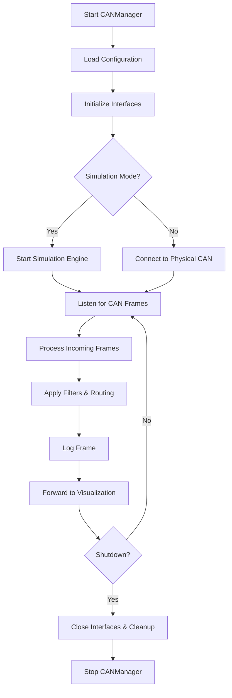
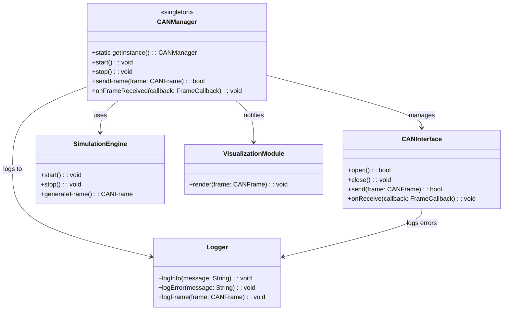

# c01-43_CANManager.md

## Overview
The **CANManager** class is a central orchestrator for Controller Area Network (CAN) data flows. It handles the initialization of CAN interfaces, simulation of CAN traffic, processing of incoming/outgoing frames, logging, and forwarding data to visualization components.

## Responsibilities
- Initialize and configure CAN interfaces (physical and virtual).
- Support simulation mode with a pluggable simulation engine.
- Process incoming CAN frames: filtering, routing, and transformation.
- Provide API for sending CAN frames.
- Log CAN traffic and events with configurable log levels.
- Forward processed frames to visualization modules.
- Graceful startup and shutdown across platforms (Linux, Windows, macOS).

## Use Case Diagram
```mermaid
usecaseDiagram
  actor User
  actor Simulation
  actor Visualization
  User --> (Initialize CANManager)
  User --> (Configure Interfaces)
  Simulation --> (Simulate CAN Data)
  (Initialize CANManager) ..> (Configure Interfaces)
  Visualization --> (Display CAN Data)
  (Simulate CAN Data) --> (Process CAN Frames)
  (Process CAN Frames) --> (Log CAN Frames)
  (Process CAN Frames) --> (Forward to Visualization)
```

## Flow of Operations


## Class Diagram


## Implementation Details
**Language Support**: C++ (SocketCAN on Linux), Windows (PCANBasic or Vector CAN drivers), macOS (virtual CAN via can-utils).

**Design Patterns**:
- Singleton for **CANManager** instance.
- Strategy or Factory for pluggable **CANInterface** implementations.
- Observer for frame reception callbacks.
- Dependency Injection for easy testing and interface swapping.

**Configuration**:
- Load from JSON/YAML file specifying interfaces, bit rates, filters, and simulation settings.
- Example snippet:
```json
{
  "interfaces": [
    { "type": "socketcan", "name": "can0", "bitrate": 500000 },
    { "type": "simulation", "name": "sim0" }
  ],
  "logging": { "level": "INFO", "file": "can_manager.log" }
}
```

## Logging Strategy
- Use structured logging (e.g., spdlog) with log levels (DEBUG, INFO, WARN, ERROR).
- Log frame metadata: timestamp, ID, data payload in hex.
- Rotate logs based on size or time.
- Example:
```cpp
spdlog::info("Received frame id={} data={}", frame.id, toHex(frame.data));
```

## Startup Sequence
1. Parse configuration.
2. Instantiate **CANInterface** objects.
3. If simulation mode, initialize **SimulationEngine**.
4. Register callbacks for frame reception.
5. Start interfaces and simulation engine.
6. Set up **VisualizationModule** listeners.

## Testing Guidelines
- **Unit Tests**: Mock **CANInterface** and **SimulationEngine** to test **CANManager** logic (Google Test).
- **Integration Tests**: Use loopback CAN interfaces or virtual CAN devices.
- **Cross-Platform**: Use CI pipelines with Docker (Linux) and Windows runners.
- **Test Cases**:
  - Frame routing and filtering logic.
  - Logging output verification.
  - Simulation start/stop behavior.
  - Error handling (interface disconnects, invalid frames).

## Best Practices
- Abstract hardware dependencies behind interfaces for testability.
- Use thread-safe queues for frame buffering.
- Handle exceptions and ensure clean shutdown on errors.
- Keep UI/visualization decoupled via event-driven architecture.
- Validate configurations at startup and fail fast on errors.


