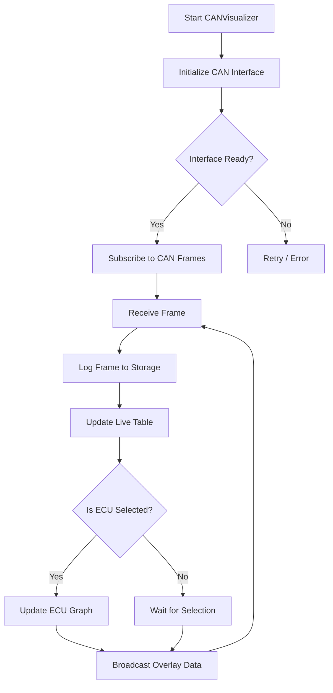
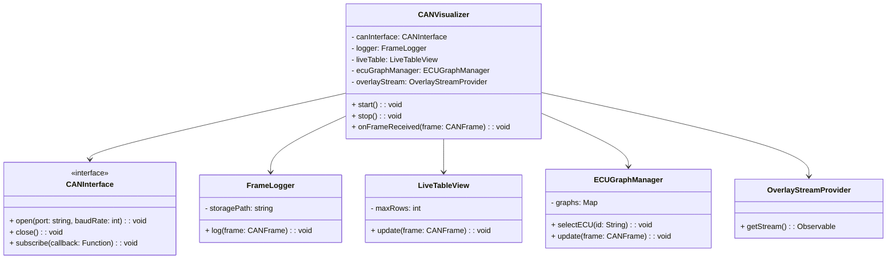

# CANVisualizer

**Version:** 1.0.0
**Module:** CAN-Bus Simulator

## Overview

The `CANVisualizer` component provides real-time visualization of CAN bus data streams. It ingests raw CAN frames, logs them, and renders both live data tables and graphical representations per ECU. Additionally, it exposes the data stream for overlay on the CAR-Simulator.

Key responsibilities:
- **Data Acquisition:** Subscribe to CAN bus events via a unified interface.
- **Data Logging:** Persist incoming frames with timestamp, ID, DLC, and payload.
- **Live Feed Display:** Tabular view of the most recent frames (left panel).
- **ECU Graphing:** Real-time plots of selected ECU metrics (bottom-right panel).
- **Overlay Stream:** Provide a standardized data API for the CAR-Simulator overlay.

## Use-Case Diagram

```mermaid
%%{init: {"theme":"base","themeVariables":{"primaryColor":"#f5f5f5"}}}%%
usecaseDiagram
    actor "End User" as User
    rectangle CANVisualizer {
        User --> (Start Visualization)
        User --> (Select ECU)
        User --> (View Live Feed)
        (Start Visualization) --> (Log Data)
        (Log Data) --> (Persist Frames)
        (Select ECU) --> (Render Graph)
        (View Live Feed) --> (Update Table)
    }
```  

## Flowchart: Data Processing Pipeline



## Class Diagram



## Class Descriptions

### CANVisualizer
- **Fields:**
  - `canInterface`: Adapter to the hardware or virtual CAN bus.
  - `logger`: Responsible for persisting all frames.
  - `liveTable`: UI component for tabular feed.
  - `ecuGraphManager`: Manages live charts per ECU.
  - `overlayStream`: Publishes data for simulator overlay.

- **Methods:**
  - `start()`: Opens CAN interface, initializes components, begins subscription.
  - `stop()`: Unsubscribes, closes interface, finalizes logs.
  - `onFrameReceived(frame)`: Central callback — logs, updates UI, publishes overlay.

### CANInterface
An abstraction over platform-specific CAN APIs (SocketCAN, Windows PCAN, Bluetooth-CAN dongles). Implements retry logic and error reporting.

### FrameLogger
Uses timestamped files or NoSQL for high-throughput logging. Should support rotation and configurable granularity (e.g., per-minute files).

### LiveTableView
Circular buffer of recent frames; renders columns: `Timestamp`, `ID`, `Flags`, `DLC`, `Data`.

### ECUGraphManager
Maintains a set of line charts. Allows dynamic ECU selection and metric mapping.

### OverlayStreamProvider
Exposes an observable or callback-based API consumed by the CAR-Simulator for drawing overlays in sync.

## Logic & Implementation Notes

1. **Initialization:** Load config (ports, baud rates, log paths). Create instances of all sub-components.
2. **CAN Subscription:** Use async I/O where possible. Frame callback must be non-blocking.
3. **Logging:** Batch writes to disk; flush on critical errors or shutdown.
4. **UI Updates:** Debounce updates to avoid UI congestion (e.g., 50–100 ms intervals).
5. **Graphing:** Use a high-performance charting library (e.g., `recharts`, `Chart.js`, `native GUI graph` depending on framework).
6. **Overlay Stream:** Buffer frames in a ring and emit at a fixed rate (e.g., 60 Hz) regardless of CAN bus jitter.

## Coding Guidelines

- **Language:** TypeScript (Electron), C++ (Qt), or Java (JavaFX) depending on host.
- **Dependency Injection:** For `CANInterface` to facilitate testing.
- **Threading:** Separate I/O thread for CAN, UI thread for rendering.
- **Error Handling:** Graceful recovery, user notifications on persistent errors.
- **Configuration:** Support JSON/YAML for cross-platform ease.

## Logging

- **Format:** `[ISO8601 Timestamp] ID DLC Data`
- **Rotation:** Daily or size-based rotation.
- **Levels:** INFO for normal, WARN for dropped frames, ERROR for interface failures.

## Startup Sequence

1. Read configuration file.
2. Instantiate `CANVisualizer` with DI container.
3. Call `visualizer.start()`.
4. Render main window with live-feed and graph panels.

## Testing Strategy

- **Unit Tests:** Mock `CANInterface` to simulate frame injection.
- **Integration Tests:** Run against a virtual CAN interface (SocketCAN vcan).
- **UI Tests:** Snapshot tests for table and chart updates (e.g., using Spectron for Electron).
- **Performance Tests:** Measure throughput, update latency, and memory usage under high bus load.

## Platform Best Practices

- **Linux:** Use SocketCAN with `libsocketcan`.
- **Windows:** PCAN/Peak drivers or vendor SDKs.
- **macOS:** Leverage `slcan` over serial adapters.
- **Permission Handling:** Provide UAC elevation or group membership guidance.
- **Packaging:** Use cross-platform bundlers (Electron-packager, Qt Installer Framework, jpackage).

---
*End of `c01-44_CANVisualizer.md`*


