# MainWindow Class (c01-45_MainWindow)

## Overview
The `MainWindow` class is the central GUI container for the TFITPICAN Canary CAN‑Bus Simulator application. It subclasses `QMainWindow` and orchestrates all visual and interactive components—data streams, images with overlays, line‑graphs, selection fields, text fields, informational text, status indicators, and tab panels—into a cohesive user interface. Widgets are managed via factory methods for flexibility and future swapping.

## Use Case Diagram
```mermaid
usecaseDiagram
    actor User
    rectangle MainWindow {
      User -- (Launch Scenario)
      User -- (Select Widget)
      User -- (View Data Stream)
      User -- (Display Images)
      User -- (Monitor Status)
    }
```

## Class Diagram
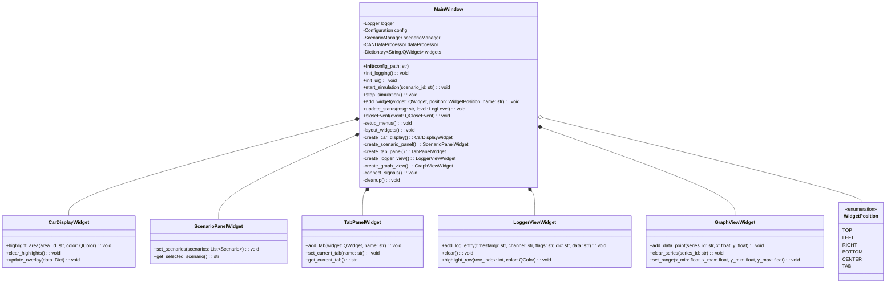

## Component Layout
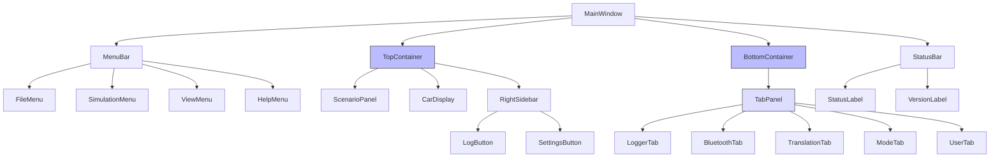

## Initialization Sequence
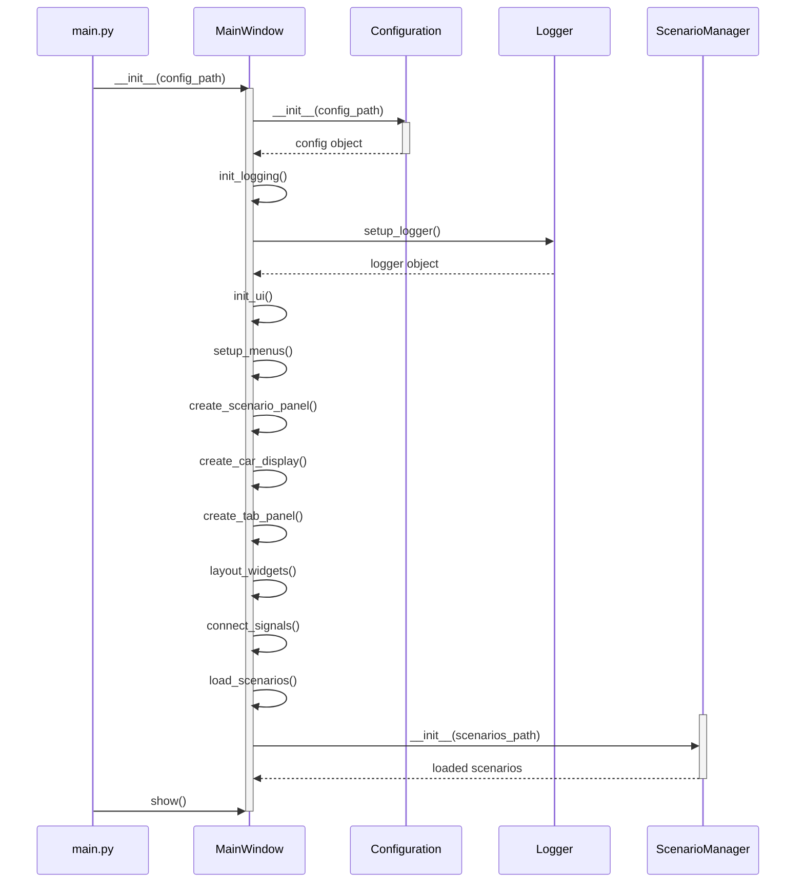

## Event Flow Diagram
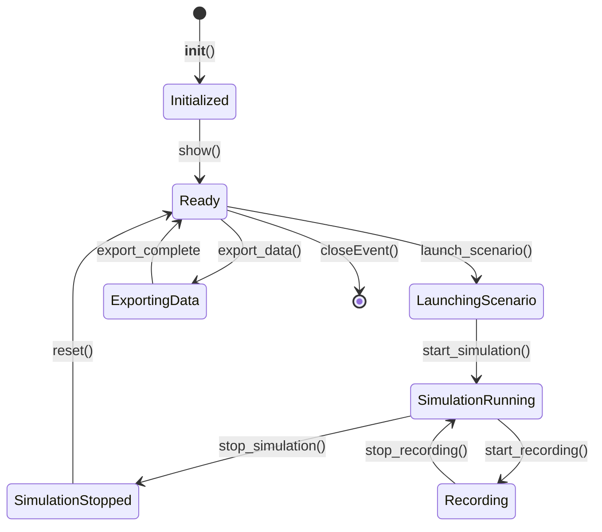

## Error Handling Strategy
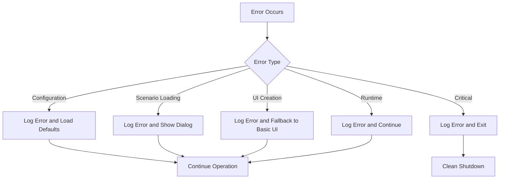

## Responsibility Breakdown
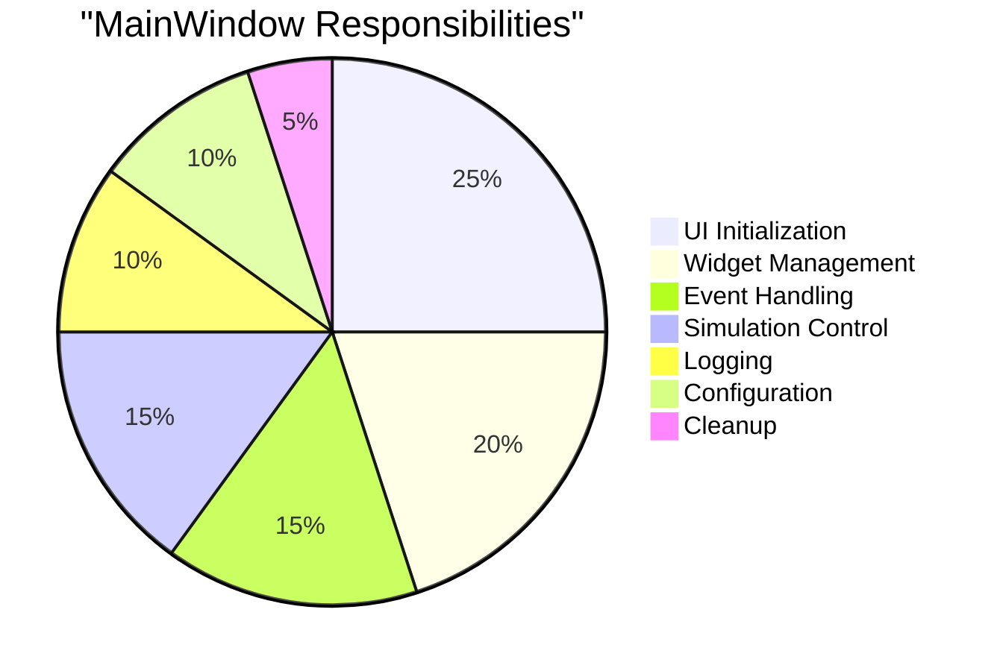

## Data Flow
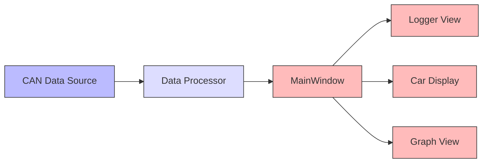

## Menu Structure
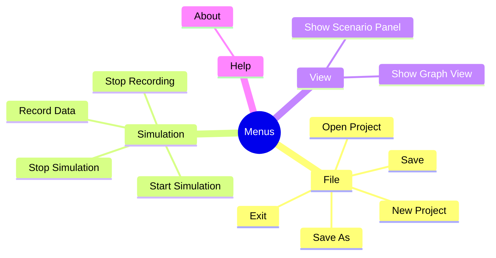

## Key Methods

### Constructor
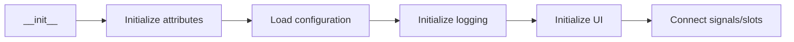

### UI Initialization
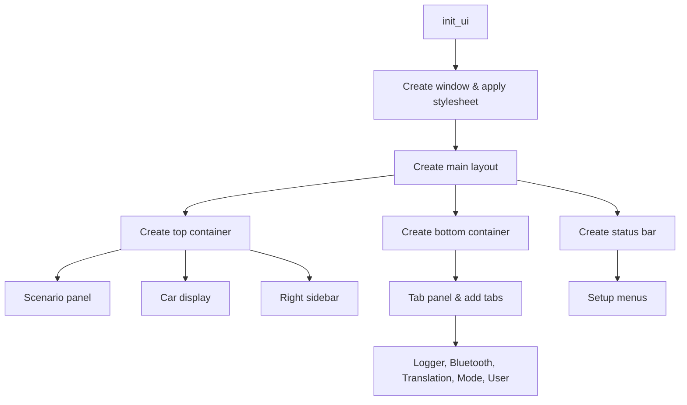

### Signal Binding
```
tabPanel.currentChanged.connect(self.handle_tab_changed)
scenarioPanel.launchClicked.connect(self.launch_scenario)
dataProcessor.messageReceived.connect(self.on_can_message)
loggerView.clearRequested.connect(self.logger.clear)
```

### Scenario Launching
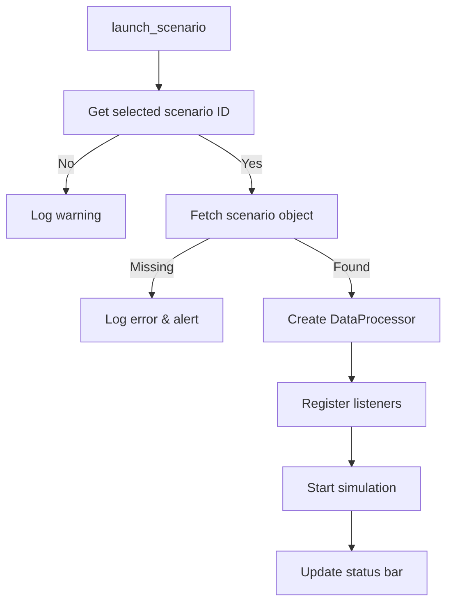

### Simulation Control
```mermaid
graph TD
    A[start_simulation] --> B{Data processor available?}
    B -->|No| C[Log warning]
    B -->|Yes| D[DP.start()]
    D --> E[Update status]
    
    F[stop_simulation] --> G{Data processor available?}
    G -->|No| H[Log warning]
    G -->|Yes| I[DP.stop()]
    I --> J[Update status]
```

## Widget Management

- **CarDisplayWidget** – Car visualization with area highlighting
- **ScenarioPanelWidget** – Scenario selection and launch controls
- **TabPanelWidget** – Tabbed interface for different views
- **LoggerViewWidget** – CAN message table with flags, DLC, data
- **GraphViewWidget** – Real‑time plots of selected signal series

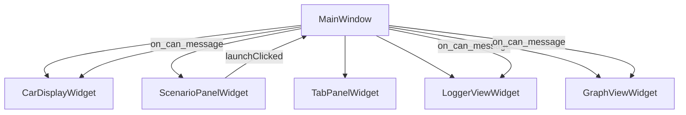

## Usage Example: Scenario Launch Sequence
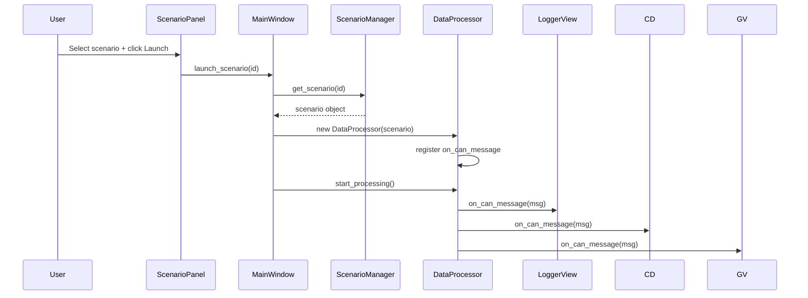

## Testing & CI

- **Unit Tests**: pytest-qt for widget init, signal/slot behavior
- **Integration Tests**: Offscreen Qt rendering in CI to verify layouts
- **Mocking**: Stub CAN sources for predictable message sequences
- **Coverage**: Target ≥ 80% on orchestration logic

## Implementation Details

### Coding Guidelines
- **Language**: Python 3.8+ with PyQt5/PySide2 (or equivalent)
- **Architecture**: MVC‑style separation; controllers handle logic, widgets handle presentation
- **Modularity**: WidgetFactory pattern for easy swapping
- **Dependency Injection**: Pass Configuration, Logger, and data sources into MainWindow

### Logging
- **Init**: init_logging() sets up console + rotating file handlers
- **Levels**: DEBUG (dev), INFO (runtime), WARNING/ERROR (issues)
- **Status Bar**: update_status() pushes to both status widget and logger

### Startup Sequence
1. Parse CLI args (config path, verbose flags)
2. Instantiate Logger
3. MainWindow = MainWindow(config_path)
4. MainWindow.start_simulation() if auto‑start
5. Enter Qt event loop

### Cross‑Platform Notes
- **macOS**: app.setAttribute(Qt.AA_UseHighDpiPixmaps) for Retina
- **Windows/Linux**: Bundle Qt plugins via pyinstaller or similar
- **Shortcuts & Styles**: Verify consistency on each OS
