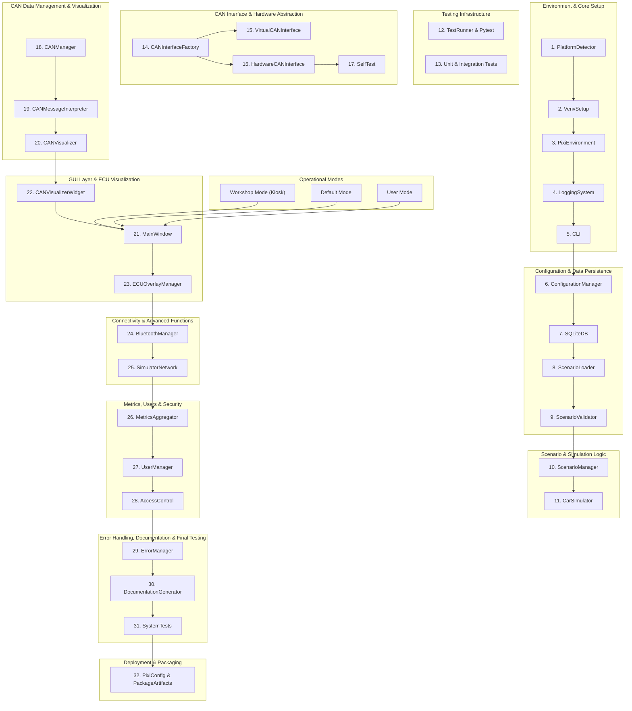

# Development Process for TF-Canary Simulator

**Version: v0.1.0**

This document outlines the step-by-step development plan for the TF-Canary CAN-Bus Simulator, mirroring the architectural flow defined in the diagram. Each section corresponds to a package in the architecture and lists tasks in sequential order, respecting explicit dependencies. The embedded Mermaid diagram provides a visual reference.

---

## Architecture Overview (Mermaid)

---

## 1. Environment & Core Setup

1. **PlatformDetector**
   - Detect host OS, CPU architecture, and environment variables.
   - Ensure cross-platform compatibility.
2. **VenvSetup**
   - Automate creation and activation of Python virtual environments.
   - Pin dependencies in requirements files.
3. **PixiEnvironment**
   - Configure project structure and base paths.
   - Load environment variables and config.
4. **LoggingSystem**
   - Implement structured logging (console & file).
   - Define logging levels and format.
5. **CLI**
   - Build command-line interface with entry points.
   - Integrate subcommands for setup and running.

## 2. Configuration & Data Persistence

6. **ConfigurationManager**
   - Parse YAML/JSON config files.
   - Merge CLI arguments and environment overrides.
7. **SQLiteDB**
   - Initialize SQLite database schema.
   - Provide ORM layer or raw queries.
8. **ScenarioLoader**
   - Load simulation scenarios from disk or DB.
   - Support multiple file formats.
9. **ScenarioValidator**
   - Validate scenario definitions against schema.
   - Throw errors or warnings for inconsistencies.

## 3. Scenario & Simulation Logic

10. **ScenarioManager**
    - Coordinate scenario lifecycle (load, start, pause, stop).
11. **CarSimulator**
    - Simulate vehicle dynamics and CAN events.
    - Expose hooks for injecting messages.

## 4. Testing Infrastructure

12. **TestRunner & Pytest**
    - Set up Pytest configuration and fixtures.
13. **Unit & Integration Tests**
    - Cover core modules, edge cases, and performance benchmarks.

## 5. CAN Interface & Hardware Abstraction

14. **CANInterfaceFactory**
    - Instantiate virtual or hardware CAN interfaces.
15. **VirtualCANInterface**
    - Emulate CAN bus for offline simulations.
16. **HardwareCANInterface**
    - Interface with physical CAN adapter.
17. **SelfTest**
    - Run hardware diagnostics and loopback tests.

## 6. CAN Data Management & Visualization

18. **CANManager**
    - Central dispatcher for CAN message flow.
19. **CANMessageInterpreter**
    - Decode and encode messages based on DBC specs.
20. **CANVisualizer**
    - Provide data streams for plotting frames and signals.

## 7. GUI Layer & ECU Visualization

21. **MainWindow**
    - Scaffold main application window.
22. **CANVisualizerWidget**
    - Embed real-time plotting and signal views.
23. **ECUOverlayManager**
    - Render overlays of electronic control units on visuals.

## 8. Connectivity & Advanced Functions

24. **BluetoothManager**
    - Pair with external devices (e.g., mobile app).
25. **SimulatorNetwork**
    - Enable distributed simulations and telemetry.

## 9. Metrics, Users & Security

26. **MetricsAggregator**
    - Collect performance and usage metrics.
27. **UserManager**
    - Manage user profiles and preferences.
28. **AccessControl**
    - Enforce role-based permissions.

## 10. Error Handling, Documentation & Final Testing

29. **ErrorManager**
    - Central error capture and reporting.
30. **DocumentationGenerator**
    - Auto-generate API docs and diagrams.
31. **SystemTests**
    - End-to-end tests in real or simulated hardware.

## 11. Deployment & Packaging

32. **PixiConfig & PackageArtifacts**
    - Bundle application with PyInstaller or similar.
    - Create installer and archive artifacts.

## 12. Operational Modes

- **Workshop Mode (Kiosk)**: Launch UI in full-screen interactive mode.
- **Default Mode**: Standard desktop simulation.
- **User Mode**: Restrict UI features for end-user scenarios.

---

*End of Development Process Document.*

